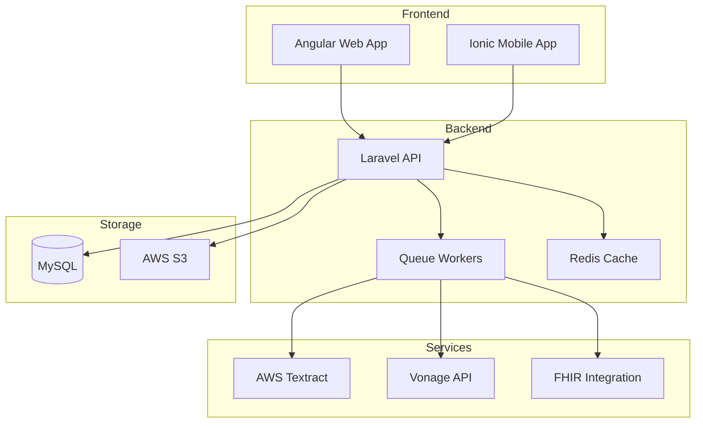

# AUSTA Integration Platform (AOP)

[](https://shields.io)
[](https://shields.io)
[](https://shields.io)
[](https://shields.io)
[](https://shields.io)

Enterprise-grade digital healthcare enrollment solution with AI-driven document processing, video interviews, and EMR integration capabilities.

## Overview

AUSTA Integration Platform (AOP) transforms traditional paper-based healthcare enrollment into a secure, digital experience with:

- AI-powered document analysis and OCR processing
- Real-time video medical interviews
- Multi-language support (en-US, pt-BR, es-ES)
- EMR system integration via FHIR standards
- Zero-trust security architecture
- HIPAA, GDPR, and LGPD compliance

## System Architecture



## Prerequisites

### Development Environment
- PHP 8.1+
- Node.js 16+
- MySQL 8.0+
- Redis 6.0+
- Docker 20.10+

### Cloud Services
- AWS Account (S3, Textract)
- Vonage Video API Account
- SSL Certificates

## Quick Start

1. Clone the repository:
```bash
git clone https://github.com/austa/integration-platform.git
cd integration-platform
```

2. Install backend dependencies:
```bash
cd src/backend
composer install
cp .env.example .env
php artisan key:generate
```

3. Install frontend dependencies:
```bash
cd ../web
npm install
```

4. Configure environment variables:
```bash
# Backend (.env)
DB_CONNECTION=mysql
DB_HOST=mysql
REDIS_HOST=redis
AWS_ACCESS_KEY_ID=your_key
AWS_SECRET_ACCESS_KEY=your_secret

# Frontend (environment.ts)
apiUrl: 'https://api.austa.local'
```

5. Start development environment:
```bash
docker-compose up -d
```

## Development Guide

### Code Structure
```
src/
├── backend/           # Laravel API
│   ├── app/
│   ├── config/
│   └── docker/
├── web/              # Angular Frontend
│   ├── src/
│   └── e2e/
└── docs/             # Documentation
```

### Security Implementation

- JWT authentication with Laravel Sanctum
- Zero-trust architecture
- Field-level encryption for PHI/PII
- HIPAA-compliant audit logging
- Rate limiting and circuit breakers

### Compliance Features

- HIPAA audit trails
- GDPR consent management
- LGPD data protection
- EMR integration via FHIR
- Secure video consultations

## Deployment

### Production Requirements
- AWS ECS cluster
- RDS MySQL (Multi-AZ)
- ElastiCache Redis cluster
- CloudFront CDN
- Route 53 DNS

### Deployment Steps
1. Build Docker images:
```bash
docker-compose build
```

2. Push to ECR:
```bash
aws ecr get-login-password | docker login --username AWS --password-stdin
docker-compose push
```

3. Deploy to ECS:
```bash
aws ecs update-service --force-new-deployment
```

## Contributing

1. Fork the repository
2. Create feature branch (`git checkout -b feature/name`)
3. Commit changes (`git commit -am 'Add feature'`)
4. Push branch (`git push origin feature/name`)
5. Create Pull Request

## License

Proprietary - All rights reserved

## Support

Contact: support@austa.local