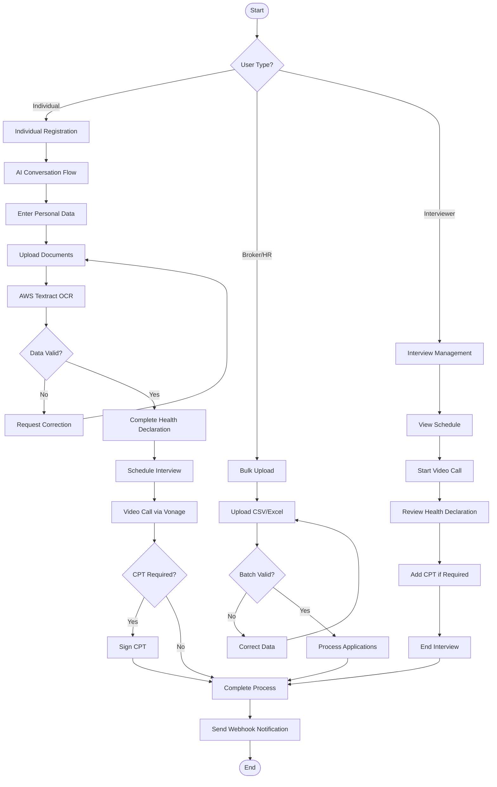
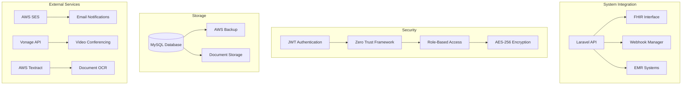
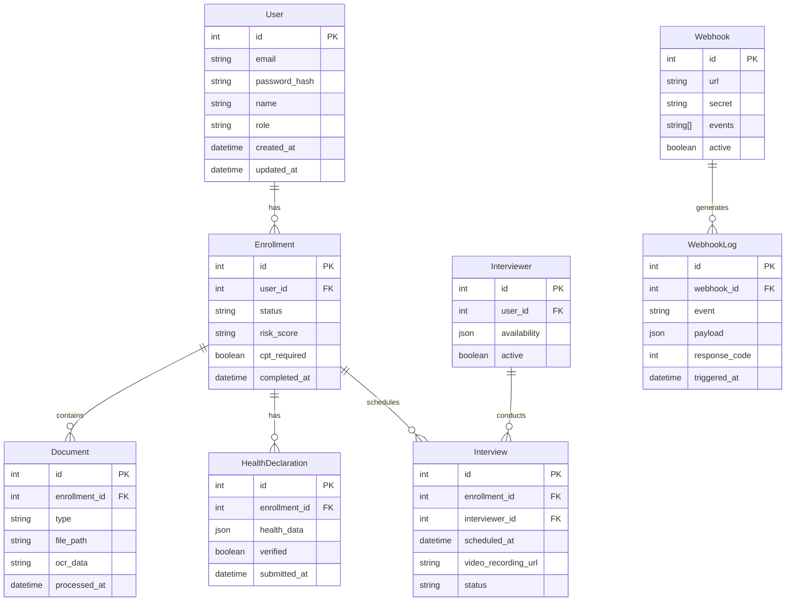
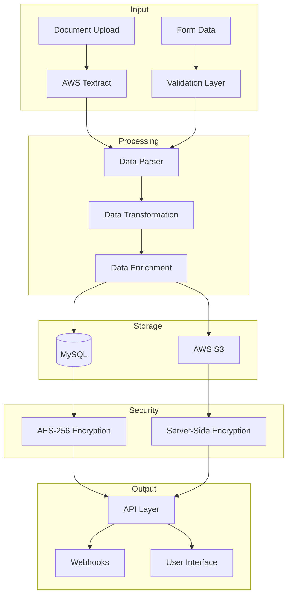
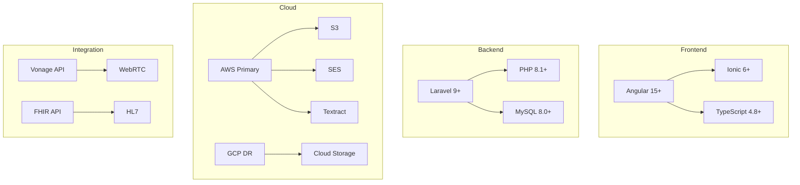

# Product Requirements Document (PRD)

# 1. INTRODUCTION

## 1.1 Purpose

This Software Requirements Specification (SRS) document provides a comprehensive description of the AUSTA Integration Platform (AOP). It details the functional and non-functional requirements for developers, system architects, project managers, and stakeholders involved in the development and implementation of the healthcare enrollment system. This document serves as the primary reference for technical requirements and will be used throughout the development lifecycle.

## 1.2 Scope

The AUSTA Integration Platform is a digital healthcare enrollment system that transforms traditional paper-based processes into a modern, AI-driven experience. The system encompasses:

### Core Functionalities
- End-to-end digital enrollment processing
- AI-powered document analysis and validation
- Multi-user role support (individuals, brokers, HR teams, clinical staff)
- Video conferencing capabilities for medical interviews
- EMR system integration through FHIR standards
- Webhook-based integration capabilities

### Key Benefits
- Streamlined enrollment process with reduced processing time
- Enhanced user engagement through gamification
- Improved data accuracy through AI-assisted validation
- Reduced operational costs and manual intervention
- Real-time status tracking and notifications
- Multi-language support (Portuguese, English, Spanish)

### System Boundaries
- Web and mobile interfaces built with Angular and Ionic
- Backend services powered by Laravel
- Integration with AWS services for OCR and email processing
- MySQL database for data persistence
- Video conferencing through Vonage integration
- Zero-trust security framework with JWT authentication

The system explicitly excludes:
- Direct EMR system modifications
- Healthcare provider scheduling systems
- Insurance claims processing
- Billing and payment processing
- Medical record management

# 2. PRODUCT DESCRIPTION

## 2.1 Product Perspective
The AUSTA Integration Platform operates as a standalone healthcare enrollment system while integrating with existing healthcare infrastructure through standardized interfaces. The system fits into the broader healthcare ecosystem through:

- FHIR-compliant EMR system integration
- Webhook-based notifications for external systems
- AWS services integration for document processing and email communications
- Vonage integration for video conferencing capabilities
- Multi-cloud deployment across AWS (primary) and GCP (disaster recovery)

## 2.2 Product Functions
The platform provides the following core functions:

- Digital enrollment processing with AI-assisted validation
- Document scanning and OCR processing via AWS Textract
- Multi-language conversational interfaces powered by LLM
- Video-based medical interviews through Vonage integration
- Real-time status tracking and notifications
- Gamified user engagement system
- Role-based administrative dashboards
- Bulk data processing for brokers/HR teams
- Calendar management for medical interviews
- Webhook-based system integrations

## 2.3 User Characteristics

### Individual Users
- Basic digital literacy required
- Access through web browsers or mobile devices
- May require assistance with document uploads
- Portuguese, English, or Spanish language proficiency

### Brokers/HR Teams
- Intermediate technical proficiency
- Experience with bulk data operations
- Understanding of healthcare enrollment processes
- Regular system usage for multiple applications

### Medical Interviewers
- Healthcare professional background
- Comfortable with video conferencing tools
- Experience with digital health records
- Regular daily system access

### System Administrators
- Advanced technical expertise
- Understanding of healthcare compliance requirements
- Knowledge of system integration patterns
- Regular monitoring and maintenance duties

## 2.4 Constraints

### Technical Constraints
- Angular/Ionic frontend framework requirements
- Laravel backend framework limitations
- MySQL database scalability considerations
- AWS/GCP service region availability
- Mobile device compatibility requirements

### Regulatory Constraints
- HIPAA compliance requirements
- GDPR data protection standards
- LGPD Brazilian privacy laws
- Healthcare industry regulations
- Data retention policies

### Operational Constraints
- 99.99% uptime requirement
- Sub-second response time requirements
- Multi-language support maintenance
- Video conferencing bandwidth requirements
- Document storage capacity limitations

## 2.5 Assumptions and Dependencies

### Assumptions
- Users have stable internet connectivity
- Basic device compatibility (modern browsers/smartphones)
- Available technical support during business hours
- Regular system maintenance windows
- Adequate user training resources

### Dependencies
- AWS services availability
- Vonage platform stability
- EMR system interfaces
- Third-party authentication services
- External webhook consumers
- Database backup systems
- Network infrastructure reliability
- SSL certificate maintenance
- Regular security updates
- Continuous monitoring services

# 3. PROCESS FLOWCHART





# 4. FUNCTIONAL REQUIREMENTS

## 4.1 User Management and Authentication

| ID | Description | Priority |
|---|---|---|
| F1.1 | JWT-based authentication system with role-based access control | High |
| F1.2 | Multi-factor authentication support for administrative users | Medium |
| F1.3 | Password recovery and account management functionality | High |
| F1.4 | User session management and automatic timeout after inactivity | High |
| F1.5 | Role-based dashboard access (Individual, Broker/HR, Interviewer, Admin) | High |

## 4.2 Individual Enrollment Process

| ID | Description | Priority |
|---|---|---|
| F2.1 | AI-powered conversational interface for guided enrollment | High |
| F2.2 | Personal data collection and validation forms | High |
| F2.3 | Document upload with AWS Textract OCR processing | High |
| F2.4 | Health declaration form submission | High |
| F2.5 | Interview scheduling through calendar integration | High |
| F2.6 | Vonage-powered video conferencing for medical interviews | High |
| F2.7 | Digital CPT signature collection when required | High |
| F2.8 | Real-time enrollment status tracking | Medium |

## 4.3 Broker/HR Management

| ID | Description | Priority |
|---|---|---|
| F3.1 | Bulk user upload via CSV/Excel files | High |
| F3.2 | Real-time data validation for bulk uploads | High |
| F3.3 | Multiple owner and dependent registration capability | High |
| F3.4 | Document attachment management | High |
| F3.5 | Proposal status monitoring dashboard | High |
| F3.6 | Sales reporting and analytics | Medium |

## 4.4 Interview Management

| ID | Description | Priority |
|---|---|---|
| F4.1 | Interviewer calendar management with customizable schedules | High |
| F4.2 | Health declaration review interface | High |
| F4.3 | Video conference initiation and management | High |
| F4.4 | CPT assignment functionality | High |
| F4.5 | Interview completion and documentation | High |
| F4.6 | Break time and availability management | Medium |

## 4.5 System Integration

| ID | Description | Priority |
|---|---|---|
| F5.1 | FHIR-compliant API endpoints | High |
| F5.2 | Webhook configuration and management | High |
| F5.3 | EMR system integration capabilities | High |
| F5.4 | Email notification system via AWS SES | High |
| F5.5 | Document storage and retrieval system | High |

## 4.6 Gamification Features

| ID | Description | Priority |
|---|---|---|
| F6.1 | Progress tracking with completion badges | Medium |
| F6.2 | Achievement system for enrollment milestones | Medium |
| F6.3 | User engagement notifications | Medium |
| F6.4 | Progress visualization dashboard | Low |

## 4.7 Multilingual Support

| ID | Description | Priority |
|---|---|---|
| F7.1 | Portuguese language interface (primary) | High |
| F7.2 | English language interface | Medium |
| F7.3 | Spanish language interface | Medium |
| F7.4 | Language preference management | Medium |

## 4.8 Administrative Functions

| ID | Description | Priority |
|---|---|---|
| F8.1 | User activity monitoring and audit logs | High |
| F8.2 | System configuration management | High |
| F8.3 | Role and permission management | High |
| F8.4 | Performance monitoring dashboard | Medium |
| F8.5 | System backup and recovery tools | High |

# 5. NON-FUNCTIONAL REQUIREMENTS

## 5.1 Performance Requirements

| Requirement | Description | Target Metric |
|------------|-------------|---------------|
| Response Time | Maximum time for API responses | < 1 second |
| Page Load Time | Initial page load performance | < 3 seconds |
| Video Call Quality | Minimum video conference quality | 720p at 30fps |
| Concurrent Users | Maximum simultaneous users supported | 10,000 |
| Database Queries | Maximum query execution time | < 100ms |
| File Upload | Maximum document upload processing time | < 15 seconds |
| Bulk Processing | Maximum time for broker bulk uploads | < 5 minutes for 1000 records |

## 5.2 Safety Requirements

| Requirement | Description | Implementation |
|------------|-------------|----------------|
| Data Backup | Regular automated backups | Daily incremental, weekly full |
| Failover System | Multi-region disaster recovery | AWS primary, GCP secondary |
| Data Recovery | Maximum data recovery time | < 4 hours |
| Session Management | Automatic session termination | After 15 minutes of inactivity |
| Error Handling | Graceful error recovery | User-friendly error messages |
| Data Validation | Input validation before processing | Server-side validation rules |
| Audit Trail | Complete activity logging | Immutable audit logs |

## 5.3 Security Requirements

| Requirement | Description | Implementation |
|------------|-------------|----------------|
| Authentication | Multi-factor authentication | JWT + TOTP for admin users |
| Authorization | Role-based access control | Zero-trust framework |
| Data Encryption | Data protection standards | AES-256 at rest, TLS 1.3 in transit |
| API Security | API access control | OAuth 2.0 with rate limiting |
| Password Policy | Password complexity rules | Min 12 chars, special chars required |
| Session Security | Secure session handling | HTTP-only cookies, CSRF protection |
| Document Security | Secure document storage | Encrypted S3 buckets |

## 5.4 Quality Requirements

### 5.4.1 Availability
- System uptime: 99.99%
- Planned maintenance windows: Monthly, < 2 hours
- Maximum unplanned downtime: 4 hours/year
- Service degradation notification: < 5 minutes

### 5.4.2 Maintainability
- Code coverage: Minimum 80%
- Documentation: Updated within 24 hours of changes
- Deployment frequency: Capability for daily releases
- Rollback time: < 15 minutes

### 5.4.3 Usability
- WCAG 2.1 Level AA compliance
- Maximum 3 clicks to reach any feature
- Mobile responsiveness: All features accessible on devices
- Supported browsers: Latest 2 versions of major browsers

### 5.4.4 Scalability
- Horizontal scaling: Auto-scaling based on load
- Storage scaling: Automatic expansion up to 1TB
- API rate limiting: 1000 requests per minute per client
- Database connections: Up to 10,000 concurrent connections

### 5.4.5 Reliability
- Mean Time Between Failures (MTBF): > 720 hours
- Mean Time To Recovery (MTTR): < 30 minutes
- Error rate: < 0.1% of all transactions
- Data consistency: Real-time replication between regions

## 5.5 Compliance Requirements

| Requirement | Description | Implementation |
|------------|-------------|----------------|
| HIPAA | Healthcare data privacy | Encrypted PHI, access controls |
| GDPR | European data protection | Data portability, right to erasure |
| LGPD | Brazilian privacy law | Consent management, data handling |
| FHIR | Healthcare data standard | FHIR R4 compliant APIs |
| ISO 27001 | Information security | Security controls framework |
| SOC 2 | Service organization controls | Annual compliance audits |
| WCAG 2.1 | Accessibility standards | AA level compliance |

# 6. DATA REQUIREMENTS

## 6.1 Data Models



## 6.2 Data Storage

### 6.2.1 Primary Storage
- MySQL database for transactional data
- AWS S3 for document storage with server-side encryption
- Redis for session management and caching

### 6.2.2 Data Retention
- Enrollment data: 7 years
- Document files: 5 years
- Video recordings: 2 years
- Audit logs: 5 years
- Session data: 24 hours
- Cache data: 1 hour

### 6.2.3 Backup Strategy
- Daily incremental backups
- Weekly full backups
- Cross-region replication to GCP
- Point-in-time recovery capability
- 30-day backup retention

### 6.2.4 Recovery Procedures
- RTO (Recovery Time Objective): 4 hours
- RPO (Recovery Point Objective): 15 minutes
- Automated failover to GCP
- Database instance recovery from snapshots
- Document restoration from S3 versioning

## 6.3 Data Processing



### 6.3.1 Data Security
- AES-256 encryption for data at rest
- TLS 1.3 for data in transit
- Field-level encryption for PHI
- Data masking for non-privileged users
- Key rotation every 90 days

### 6.3.2 Data Validation
- Schema validation using Laravel validators
- Business rule validation layer
- OCR confidence scoring
- Document authenticity verification
- Data format standardization

### 6.3.3 Data Integration
- FHIR-compliant API endpoints
- Webhook delivery with retry mechanism
- EMR system data mapping
- Bulk data import/export capabilities
- Real-time data synchronization

### 6.3.4 Data Quality
- Automated data cleansing
- Duplicate detection
- Data completeness checks
- Consistency validation
- Regular data quality audits

# 7. EXTERNAL INTERFACES

## 7.1 User Interfaces

### 7.1.1 Web Application Interface
- Angular-based responsive web interface
- Minimum supported resolutions: 1366x768 (desktop), 375x667 (mobile)
- WCAG 2.1 Level AA compliance
- Support for latest two versions of Chrome, Firefox, Safari, and Edge
- Dark/light theme support with high contrast options
- Responsive design breakpoints:
  - Mobile: < 768px
  - Tablet: 768px - 1024px
  - Desktop: > 1024px

### 7.1.2 Mobile Application Interface
- Ionic-based mobile application
- Native-like experience on iOS 14+ and Android 10+
- Support for biometric authentication
- Offline data synchronization capabilities
- Push notification support
- Camera integration for document scanning

## 7.2 Hardware Interfaces

### 7.2.1 Camera Interface
- Support for device cameras with minimum 5MP resolution
- Auto-focus capability required
- Flash control for document scanning
- Support for both front and rear cameras

### 7.2.2 Biometric Devices
- Integration with device fingerprint sensors
- Support for Face ID on iOS devices
- Windows Hello compatibility for desktop
- Secure enclave integration where available

## 7.3 Software Interfaces

### 7.3.1 EMR System Integration
| System | Protocol | Data Format | Authentication |
|--------|-----------|-------------|----------------|
| FHIR API | REST/HTTPS | FHIR R4 | OAuth 2.0 |
| EMR Systems | HL7 v2.x | XML/JSON | API Key |
| Document Storage | AWS S3 API | Binary/Base64 | IAM Role |

### 7.3.2 External Service Integration
| Service | Purpose | Protocol | Format |
|---------|----------|-----------|---------|
| AWS Textract | OCR Processing | REST/HTTPS | JSON |
| AWS SES | Email Communication | SMTP/API | MIME |
| Vonage | Video Conferencing | WebRTC | Binary |
| MySQL | Data Persistence | TCP/IP | SQL |

## 7.4 Communication Interfaces

### 7.4.1 Network Protocols
- HTTPS (TLS 1.3) for all web traffic
- WebSocket for real-time updates
- MQTT for push notifications
- gRPC for internal service communication

### 7.4.2 API Specifications
```yaml
OpenAPI:
  version: 3.0.0
  security:
    - JWT: []
    - OAuth2: []
  endpoints:
    /api/v1:
      rate-limit: 1000/minute
      timeout: 30s
      formats:
        - application/json
        - application/fhir+json
```

### 7.4.3 Webhook Interface
- HTTPS POST requests
- JSON payload format
- Retry mechanism: 3 attempts with exponential backoff
- Signature verification using HMAC-SHA256
- Maximum payload size: 5MB

### 7.4.4 Message Formats
```json
{
  "webhook_event": {
    "event_type": "string",
    "timestamp": "ISO8601",
    "payload": {
      "data": "object",
      "metadata": "object"
    },
    "signature": "string"
  }
}
```

# 8. APPENDICES

## 8.1 GLOSSARY

| Term | Definition |
|------|------------|
| Zero-trust Framework | Security model that requires strict identity verification for every person and device trying to access resources, regardless of location |
| Webhook | HTTP callback that occurs when something happens; a way for apps to provide real-time information to other applications |
| CPT | Consent for Processing Terms - Legal document requiring signature for healthcare enrollment |
| OCR | Optical Character Recognition - Technology that converts images of text into machine-readable text |
| EMR | Electronic Medical Record - Digital version of a patient's paper medical chart |
| LLM | Large Language Model - AI system trained to understand and generate human-like text |

## 8.2 ACRONYMS

| Acronym | Expansion |
|---------|-----------|
| AOP | AUSTA Integration Platform |
| API | Application Programming Interface |
| AWS | Amazon Web Services |
| FHIR | Fast Healthcare Interoperability Resources |
| GCP | Google Cloud Platform |
| GDPR | General Data Protection Regulation |
| HIPAA | Health Insurance Portability and Accountability Act |
| IAM | Identity and Access Management |
| JWT | JSON Web Token |
| LGPD | Lei Geral de Proteção de Dados (Brazilian General Data Protection Law) |
| RBAC | Role-Based Access Control |
| SES | Simple Email Service |
| TOTP | Time-based One-Time Password |
| WCAG | Web Content Accessibility Guidelines |

## 8.3 ADDITIONAL REFERENCES

| Reference | Description | URL |
|-----------|-------------|-----|
| Laravel Documentation | Official documentation for Laravel framework | https://laravel.com/docs |
| Angular Documentation | Official documentation for Angular framework | https://angular.io/docs |
| FHIR R4 Specification | Healthcare data interoperability standard | https://hl7.org/fhir/R4/ |
| AWS Textract Documentation | AWS OCR service documentation | https://docs.aws.amazon.com/textract/ |
| Vonage API Documentation | Video conferencing integration docs | https://developer.vonage.com/api/ |
| HIPAA Compliance Guide | Healthcare privacy compliance requirements | https://www.hhs.gov/hipaa/ |
| WCAG 2.1 Guidelines | Web accessibility standards | https://www.w3.org/WAI/WCAG21/Understanding/ |

## 8.4 TECHNOLOGY STACK DETAILS

