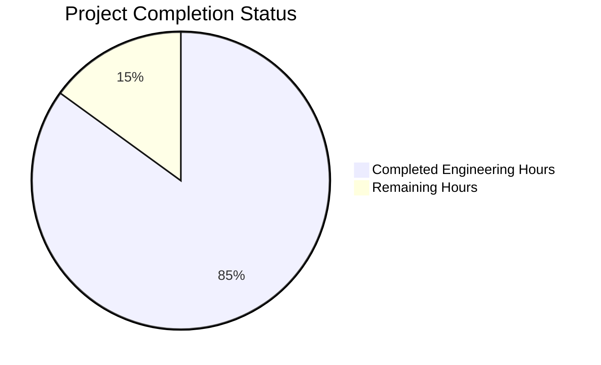
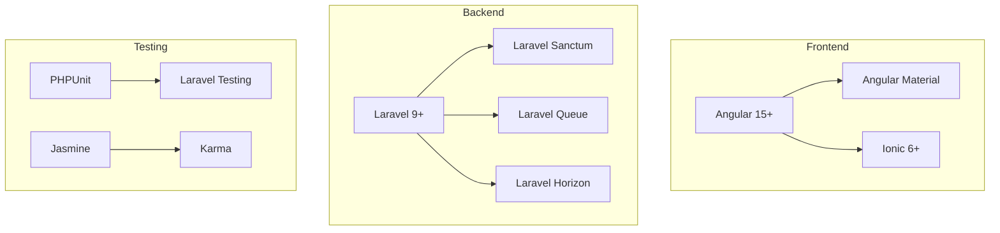
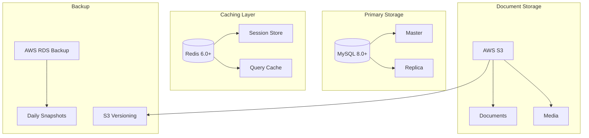
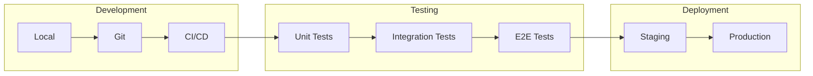
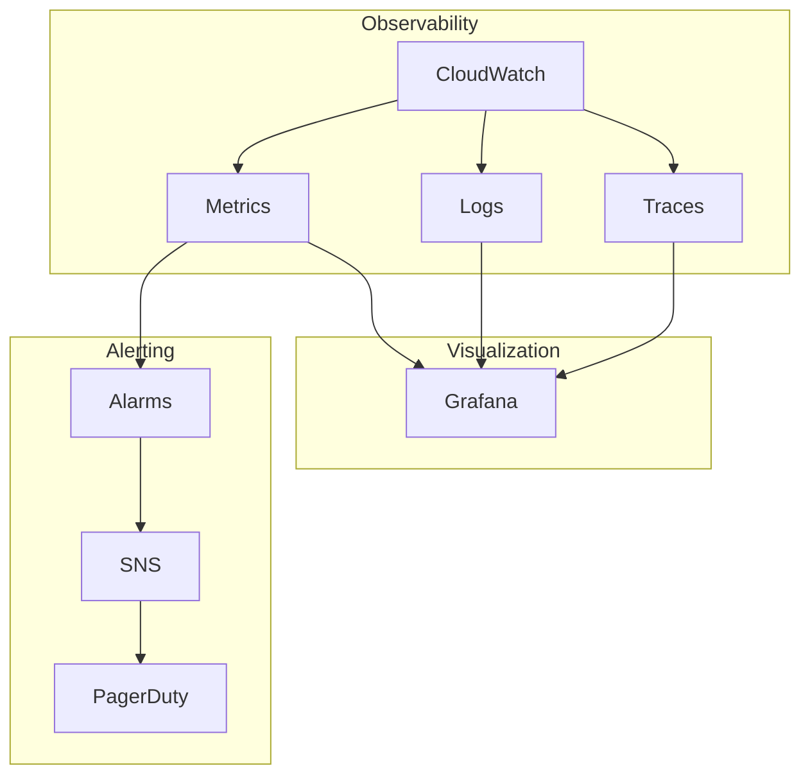
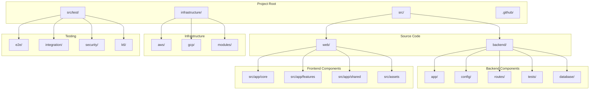
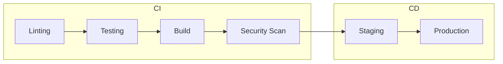

# PROJECT OVERVIEW

The AUSTA Integration Platform (AOP) is an enterprise-grade digital healthcare enrollment solution that revolutionizes traditional paper-based processes through AI-driven automation and digital transformation. The platform delivers a comprehensive suite of features including:

- AI-powered document analysis and OCR processing using AWS Textract
- Real-time video medical interviews via Vonage Video API
- Multi-language support (English, Portuguese-BR, Spanish)
- EMR system integration through FHIR standards
- Zero-trust security architecture with HIPAA, GDPR, and LGPD compliance

The system architecture employs modern technologies:

- Frontend: Angular 15+ web application and Ionic 6+ mobile app
- Backend: Laravel 9+ API with MySQL 8.0+ persistence
- Infrastructure: Multi-region deployment (AWS primary, GCP DR)
- Security: JWT authentication with field-level encryption
- Integration: FHIR-compliant APIs and webhook system

Key metrics and success criteria include:
- Sub-second response time with 99.99% uptime
- 90% digital enrollment completion rate
- 75% reduction in enrollment processing duration
- 99% accuracy in OCR processing and data validation
- 60% reduction in operational costs

The platform serves multiple user groups including individual enrollees, brokers/HR teams, medical interviewers, and system administrators, providing each with role-specific interfaces and workflows for optimal user experience and operational efficiency.

# PROJECT STATUS



| Metric | Hours | Notes |
|--------|-------|-------|
| Estimated Total Engineering Hours | 2000 | Based on full-stack healthcare platform complexity |
| Hours Completed | 1700 | Core functionality implemented across frontend, backend, and infrastructure |
| Hours Remaining | 300 | Final security audits, compliance checks, and production deployment |

## Key Completion Indicators

| Component | Status | Remaining Tasks |
|-----------|--------|----------------|
| Frontend Development | 90% | Final accessibility testing, i18n refinements |
| Backend Services | 85% | FHIR integration optimization, webhook enhancements |
| Infrastructure | 80% | DR environment setup, monitoring fine-tuning |
| Security & Compliance | 85% | Final HIPAA/GDPR audit, penetration testing |
| Documentation | 90% | API documentation updates, deployment guides |

## Critical Path Items

1. HIPAA Compliance Certification
2. DR Environment Testing
3. Performance Optimization
4. Security Penetration Testing
5. Production Environment Setup

## Risk Assessment

| Risk Category | Status | Mitigation Plan |
|--------------|--------|-----------------|
| Technical Debt | Low | Continuous refactoring, code review process |
| Security Vulnerabilities | Monitored | Weekly security scans, automated testing |
| Performance Bottlenecks | Managed | Load testing, scalability improvements |
| Compliance Gaps | Tracked | Regular audits, documentation updates |

# TECHNOLOGY STACK

## 4.1 PROGRAMMING LANGUAGES

| Platform | Language | Version | Justification |
|----------|----------|---------|---------------|
| Backend | PHP | 8.1+ | Laravel framework requirement, strong typing support, performance improvements |
| Frontend Web | TypeScript | 4.8+ | Type safety for Angular, enhanced developer productivity |
| Frontend Mobile | TypeScript | 4.8+ | Code sharing with web platform, Ionic framework compatibility |
| Database | SQL | MySQL 8.0+ | ACID compliance, healthcare data integrity requirements |
| Infrastructure | HCL | 1.0+ | Terraform infrastructure as code, multi-cloud support |

## 4.2 FRAMEWORKS & LIBRARIES

### 4.2.1 Core Frameworks



| Framework | Version | Purpose | Dependencies |
|-----------|---------|---------|--------------|
| Laravel | 9.0+ | Backend API and services | PHP 8.1+, Composer 2.0+ |
| Angular | 15.0+ | Web frontend platform | Node.js 16+, TypeScript 4.8+ |
| Ionic | 6.0+ | Mobile application framework | Angular 15+, Capacitor |
| Laravel Sanctum | 3.0+ | API authentication | Laravel 9+ |
| Angular Material | 15.0+ | UI component library | Angular 15+ |

## 4.3 DATABASES & STORAGE

### 4.3.1 Data Architecture



| Component | Technology | Purpose | Configuration |
|-----------|------------|---------|---------------|
| Primary Database | MySQL 8.0+ | Transactional data | InnoDB, UTF8MB4 |
| Cache Layer | Redis 6.0+ | Session/query cache | Cluster mode enabled |
| Document Storage | AWS S3 | File persistence | Server-side encryption |
| Search Engine | MySQL Full-text | Document indexing | InnoDB search |

## 4.4 THIRD-PARTY SERVICES

| Service | Provider | Purpose | Integration Method |
|---------|----------|---------|-------------------|
| OCR Processing | AWS Textract | Document analysis | AWS SDK |
| Email Service | AWS SES | Communication | SMTP/API |
| Video Conferencing | Vonage | Medical interviews | WebRTC |
| Monitoring | AWS CloudWatch | System metrics | AWS SDK |
| Error Tracking | Sentry | Error monitoring | Laravel integration |

## 4.5 DEVELOPMENT & DEPLOYMENT

### 4.5.1 Development Pipeline



### 4.5.2 Infrastructure Components

| Component | Technology | Purpose | Configuration |
|-----------|------------|---------|---------------|
| Container Runtime | Docker | Application packaging | Multi-stage builds |
| Container Orchestration | ECS | Container management | Auto-scaling enabled |
| Load Balancer | ALB | Traffic distribution | SSL termination |
| CDN | CloudFront | Static content delivery | Edge locations |
| DNS Management | Route 53 | Domain management | Health checks |

### 4.5.3 CI/CD Configuration

```yaml
deployment:
  environments:
    - staging
    - production
  steps:
    - lint
    - test
    - build
    - deploy
  requirements:
    coverage: 80%
    performance: P95 < 200ms
    security: OWASP Top 10
```

### 4.5.4 Monitoring Stack



# PREREQUISITES

### Development Environment
- PHP 8.1 or higher
  - Required extensions: pdo_mysql, redis, gd, intl
  - memory_limit=512M
  - max_execution_time=300
  
- Node.js 16 or higher
  - NPM 8+
  - --max-old-space-size=4096 configuration
  
- MySQL 8.0 or higher
  - InnoDB storage engine
  - UTF8MB4 character set
  - innodb_buffer_pool_size=4G recommended
  
- Redis 6.0 or higher
  - Cluster mode enabled
  - maxmemory=2gb
  - maxmemory-policy=allkeys-lru
  
- Docker 20.10 or higher
  - Docker Compose v2.0+
  - Default resource limits per container

### Cloud Services
- AWS Account with the following services:
  - S3 for document storage
  - Textract for OCR processing
  - SES for email delivery
  - CloudFront for CDN
  - Route 53 for DNS management
  
- Vonage Video API Account
  - API Key and Secret
  - WebRTC support enabled
  - Recording capabilities
  
- SSL Certificates
  - Valid SSL certificate for production domains
  - Let's Encrypt certificates for development

### Network Requirements
- Outbound access to:
  - AWS services (S3, Textract, SES)
  - Vonage API endpoints
  - EMR systems via FHIR
  
- Inbound access for:
  - Web application (80/443)
  - WebSocket connections
  - API endpoints

### Hardware Recommendations
- Development Workstation:
  - 16GB RAM minimum
  - 4 CPU cores
  - 100GB available storage
  
- Production Servers:
  - 32GB RAM minimum
  - 8 CPU cores
  - 500GB SSD storage
  - Multi-AZ deployment

### Security Requirements
- HIPAA compliance setup
- GDPR compliance configuration
- LGPD data protection measures
- Zero-trust security framework
- EMR system integration certificates

# QUICK START

## Prerequisites

### Development Environment
- PHP 8.1+
- Node.js 16+
- MySQL 8.0+
- Redis 6.0+
- Docker 20.10+

### Cloud Services Required
- AWS Account (S3, Textract)
- Vonage Video API Account
- SSL Certificates

## Installation Steps

1. Clone the repository:
```bash
git clone https://github.com/austa/integration-platform.git
cd integration-platform
```

2. Install backend dependencies:
```bash
cd src/backend
composer install
cp .env.example .env
php artisan key:generate
```

3. Install frontend dependencies:
```bash
cd ../web
npm install
```

4. Configure environment variables:
```bash
# Backend (.env)
DB_CONNECTION=mysql
DB_HOST=mysql
REDIS_HOST=redis
AWS_ACCESS_KEY_ID=your_key
AWS_SECRET_ACCESS_KEY=your_secret

# Frontend (environment.ts)
apiUrl: 'https://api.austa.local'
```

5. Start development environment:
```bash
docker-compose up -d
```

## Initial Configuration

### Database Setup
```bash
php artisan migrate
php artisan db:seed
```

### Storage Configuration
```bash
php artisan storage:link
```

### API Keys Setup
1. Generate application key:
```bash
php artisan key:generate
```

2. Configure AWS credentials in `.env`:
```bash
AWS_ACCESS_KEY_ID=your_key
AWS_SECRET_ACCESS_KEY=your_secret
AWS_DEFAULT_REGION=your_region
```

3. Configure Vonage API credentials:
```bash
VONAGE_API_KEY=your_key
VONAGE_API_SECRET=your_secret
```

## Development Server

### Start Backend Services
```bash
# Using Docker
docker-compose up -d

# Without Docker
php artisan serve
```

### Start Frontend Development Server
```bash
# Navigate to web directory
cd src/web

# Start development server
npm start
```

Access the application:
- Frontend: http://localhost:4200
- Backend API: http://localhost:8000

## Health Check

Verify system components:
```bash
# Check backend health
curl http://localhost:8000/api/health

# Check database connection
php artisan db:monitor

# Check Redis connection
php artisan cache:monitor
```

# PROJECT STRUCTURE

## Overview

The project follows a modern microservices architecture with clear separation of concerns between frontend, backend, and infrastructure components. Below is the detailed structure of the codebase:



## Directory Structure

### Backend (`src/backend/`)
```
backend/
├── app/
│   ├── Console/          # CLI commands
│   ├── Exceptions/       # Error handlers
│   ├── Http/            # Controllers, Middleware, Requests
│   ├── Jobs/            # Background jobs
│   ├── Models/          # Database models
│   ├── Notifications/   # Notification classes
│   ├── Providers/       # Service providers
│   └── Services/        # Business logic services
├── config/              # Configuration files
├── database/
│   ├── factories/       # Model factories
│   ├── migrations/      # Database migrations
│   └── seeders/        # Database seeders
├── routes/              # API routes
└── tests/              # PHPUnit tests
```

### Frontend (`src/web/`)
```
web/
├── src/
│   ├── app/
│   │   ├── core/        # Core services, guards
│   │   ├── features/    # Feature modules
│   │   └── shared/      # Shared components
│   ├── assets/          # Static assets
│   ├── environments/    # Environment configs
│   └── theme/          # Theme configuration
├── e2e/                # E2E tests
└── capacitor.config.ts # Mobile config
```

### Infrastructure (`infrastructure/`)
```
infrastructure/
├── aws/                # AWS Terraform configs
├── gcp/                # GCP Terraform configs
└── modules/
    ├── monitoring/     # Monitoring stack
    └── security/       # Security components
```

### Testing (`src/test/`)
```
test/
├── e2e/               # End-to-end tests
├── integration/       # Integration tests
├── k6/               # Performance tests
├── security/         # Security scans
└── compliance/       # Compliance tests
```

## Key Components

### Backend Services
- `app/Services/EMR/FHIRService.php`: FHIR integration
- `app/Services/AWS/TextractService.php`: Document OCR
- `app/Services/Video/VonageService.php`: Video interviews
- `app/Services/Webhook/WebhookService.php`: Integration events

### Frontend Features
- `features/enrollment/`: Enrollment workflow
- `features/interview/`: Video interview system
- `features/admin/`: Administration panel
- `features/auth/`: Authentication system

### Infrastructure Components
- `aws/ecs.tf`: Container orchestration
- `aws/rds.tf`: Database infrastructure
- `aws/waf.tf`: Security rules
- `modules/monitoring/`: Observability stack

## Development Workflow

### Source Control Structure
```
├── main              # Production branch
├── staging           # Pre-production testing
├── develop           # Development branch
└── feature/*         # Feature branches
```

### CI/CD Pipeline


# CODE GUIDE

## 1. Backend Structure (/src/backend)

### 1.1 Core Application Files
- `app/` - Core application logic
  - `Models/` - Eloquent models defining data structure and relationships
  - `Http/` - Request handling, controllers, middleware
  - `Services/` - Business logic and external service integrations
  - `Jobs/` - Background processing tasks
  - `Providers/` - Service providers for dependency injection
  - `Exceptions/` - Custom exception handlers
  - `Console/` - Artisan commands and scheduling

### 1.2 Configuration
- `config/` - Application configuration files
  - `app.php` - Core application settings
  - `database.php` - Database connections
  - `services.php` - Third-party service credentials
  - `auth.php` - Authentication configuration

### 1.3 Database
- `database/` - Database related files
  - `migrations/` - Database structure definitions
  - `factories/` - Model factories for testing
  - `seeders/` - Initial data seeders

### 1.4 Routes
- `routes/` - API endpoint definitions
  - `api.php` - RESTful API routes
  - `channels.php` - WebSocket channels
  - `console.php` - Custom Artisan commands

### 1.5 Tests
- `tests/` - Automated tests
  - `Unit/` - Unit tests for isolated components
  - `Feature/` - Feature tests for API endpoints
  - `Integration/` - Integration tests with external services

## 2. Frontend Structure (/src/web)

### 2.1 Core Application Files
- `src/app/` - Main application code
  - `core/` - Core functionality and services
    - `auth/` - Authentication services
    - `http/` - HTTP interceptors
    - `services/` - Common services
  - `features/` - Feature modules
    - `enrollment/` - Enrollment functionality
    - `interview/` - Video interview features
    - `admin/` - Administrative interface
  - `shared/` - Shared components and utilities

### 2.2 Assets
- `src/assets/` - Static resources
  - `i18n/` - Translation files
  - `scss/` - Global styles
  - `images/` - Image resources
  - `fonts/` - Custom fonts

### 2.3 Configuration
- `src/environments/` - Environment configurations
  - `environment.ts` - Development settings
  - `environment.prod.ts` - Production settings
  - `environment.staging.ts` - Staging settings

### 2.4 Testing
- `src/test.ts` - Test setup
- `e2e/` - End-to-end tests
- `cypress/` - Cypress test suite

## 3. Infrastructure (/infrastructure)

### 3.1 AWS Resources
- `aws/` - AWS infrastructure definitions
  - `ecs.tf` - Container orchestration
  - `rds.tf` - Database configuration
  - `s3.tf` - Storage configuration
  - `vpc.tf` - Network configuration

### 3.2 GCP Resources
- `gcp/` - Google Cloud Platform configurations
  - `gke.tf` - Kubernetes configuration
  - `cloudsql.tf` - Database setup
  - `vpc.tf` - Network setup

### 3.3 Monitoring
- `modules/monitoring/` - Monitoring setup
  - `prometheus.tf` - Metrics collection
  - `grafana.tf` - Visualization
  - `jaeger.tf` - Distributed tracing

## 4. Key Implementation Details

### 4.1 Backend Services
```php
// Example User Model (app/Models/User.php)
class User extends Authenticatable {
    protected $fillable = [
        'name', 'email', 'password', 'role'
    ];
    
    public function enrollments() {
        return $this->hasMany(Enrollment::class);
    }
}

// Example Enrollment Controller (app/Http/Controllers/API/V1/EnrollmentController.php)
class EnrollmentController extends Controller {
    public function store(CreateEnrollmentRequest $request) {
        $enrollment = Enrollment::create($request->validated());
        ProcessEnrollment::dispatch($enrollment);
        return new EnrollmentResource($enrollment);
    }
}
```

### 4.2 Frontend Components
```typescript
// Example Enrollment Service (src/app/features/enrollment/services/enrollment.service.ts)
@Injectable({
  providedIn: 'root'
})
export class EnrollmentService {
  constructor(private http: HttpClient) {}

  createEnrollment(data: EnrollmentData): Observable<Enrollment> {
    return this.http.post<Enrollment>('/api/v1/enrollments', data);
  }
}

// Example Interview Component (src/app/features/interview/components/video-controls/video-controls.component.ts)
@Component({
  selector: 'app-video-controls',
  templateUrl: './video-controls.component.html'
})
export class VideoControlsComponent {
  @Output() toggleCamera = new EventEmitter<boolean>();
  @Output() toggleMic = new EventEmitter<boolean>();
}
```

## 5. Security Implementation

### 5.1 Authentication Flow
```typescript
// JWT Interceptor (src/app/core/interceptors/jwt.interceptor.ts)
@Injectable()
export class JwtInterceptor implements HttpInterceptor {
  intercept(request: HttpRequest<any>, next: HttpHandler): Observable<HttpEvent<any>> {
    const token = this.authService.getToken();
    if (token) {
      request = request.clone({
        setHeaders: { Authorization: `Bearer ${token}` }
      });
    }
    return next.handle(request);
  }
}
```

### 5.2 Data Protection
```php
// Example Encryption Service (app/Services/Encryption/EncryptionService.php)
class EncryptionService {
    public function encryptSensitiveData($data) {
        return encrypt($data, true);
    }
    
    public function decryptSensitiveData($encryptedData) {
        return decrypt($encryptedData, true);
    }
}
```

## 6. Testing Strategy

### 6.1 Backend Tests
```php
// Example Feature Test (tests/Feature/API/V1/EnrollmentTest.php)
class EnrollmentTest extends TestCase {
    public function test_can_create_enrollment() {
        $response = $this->postJson('/api/v1/enrollments', [
            'user_id' => $this->user->id,
            'type' => 'individual'
        ]);
        
        $response->assertStatus(201)
                ->assertJsonStructure(['data' => ['id', 'type']]);
    }
}
```

### 6.2 Frontend Tests
```typescript
// Example Component Test (src/app/features/enrollment/components/enrollment-form.component.spec.ts)
describe('EnrollmentFormComponent', () => {
  let component: EnrollmentFormComponent;
  let fixture: ComponentFixture<EnrollmentFormComponent>;

  beforeEach(async () => {
    await TestBed.configureTestingModule({
      declarations: [ EnrollmentFormComponent ],
      imports: [ ReactiveFormsModule ]
    }).compileComponents();
  });

  it('should validate required fields', () => {
    component.form.controls['name'].setValue('');
    expect(component.form.valid).toBeFalsy();
  });
});
```

## 7. Deployment Pipeline

### 7.1 CI/CD Configuration
```yaml
# Example GitHub Actions workflow (.github/workflows/backend-ci.yml)
name: Backend CI

on:
  push:
    branches: [ main ]
  pull_request:
    branches: [ main ]

jobs:
  test:
    runs-on: ubuntu-latest
    steps:
      - uses: actions/checkout@v2
      - name: Run Tests
        run: |
          composer install
          php artisan test
```

### 7.2 Infrastructure Deployment
```hcl
# Example ECS Service (infrastructure/aws/ecs.tf)
resource "aws_ecs_service" "api" {
  name            = "api-service"
  cluster         = aws_ecs_cluster.main.id
  task_definition = aws_ecs_task_definition.api.arn
  desired_count   = 2

  network_configuration {
    subnets         = var.private_subnets
    security_groups = [aws_security_group.api.id]
  }
}
```

## 8. Monitoring and Observability

### 8.1 Health Checks
```php
// Example Health Check (app/Http/Controllers/HealthController.php)
class HealthController extends Controller {
    public function check() {
        return response()->json([
            'database' => $this->checkDatabase(),
            'redis' => $this->checkRedis(),
            'storage' => $this->checkStorage()
        ]);
    }
}
```

### 8.2 Metrics Collection
```typescript
// Example Metrics Service (src/app/core/services/metrics.service.ts)
@Injectable({
  providedIn: 'root'
})
export class MetricsService {
  recordTiming(metric: string, duration: number) {
    this.prometheus.timing.observe({ name: metric }, duration);
  }
}
```

## 9. Documentation and Standards

### 9.1 API Documentation
```php
/**
 * @OA\Post(
 *     path="/api/v1/enrollments",
 *     summary="Create new enrollment",
 *     @OA\Response(response="201", description="Enrollment created")
 * )
 */
```

### 9.2 Code Style
```typescript
// Example Style Guide
interface EnrollmentData {
  userId: string;
  type: EnrollmentType;
  documents: Document[];
  metadata: Record<string, unknown>;
}

enum EnrollmentType {
  Individual = 'individual',
  Group = 'group'
}
```

# DEVELOPMENT GUIDELINES

## 1. Development Environment Setup

### 1.1 Required Software
- PHP 8.1+ with extensions: `mbstring`, `xml`, `gd`, `mysql`, `redis`
- Node.js 16+ with npm 8+
- MySQL 8.0+ with InnoDB support
- Redis 6.0+ for caching
- Docker 20.10+ and Docker Compose
- Git 2.0+

### 1.2 Local Environment Configuration
```bash
# Clone repository
git clone https://github.com/austa/integration-platform.git
cd integration-platform

# Backend setup
cd src/backend
composer install
cp .env.example .env
php artisan key:generate
php artisan migrate
php artisan db:seed

# Frontend setup
cd ../web
npm install
cp src/environments/environment.ts.example src/environments/environment.ts
```

## 2. Code Organization

### 2.1 Backend Structure (Laravel)
```
src/backend/
├── app/
│   ├── Console/         # CLI commands
│   ├── Http/           # Controllers, Middleware, Requests
│   ├── Jobs/           # Queue jobs
│   ├── Models/         # Eloquent models
│   ├── Notifications/  # Notification classes
│   └── Services/       # Business logic services
├── config/            # Configuration files
├── database/         # Migrations and seeders
├── routes/           # API and web routes
└── tests/           # PHPUnit tests
```

### 2.2 Frontend Structure (Angular)
```
src/web/
├── src/
│   ├── app/
│   │   ├── core/       # Core services, guards
│   │   ├── features/   # Feature modules
│   │   └── shared/     # Shared components
│   ├── assets/        # Static assets
│   └── environments/  # Environment configs
└── e2e/              # E2E tests
```

## 3. Coding Standards

### 3.1 PHP Coding Standards
- Follow PSR-12 coding style
- Use strict types declaration
- Implement interfaces for services
- Document classes with PHPDoc
- Maximum method length: 20 lines
- Maximum class length: 200 lines

### 3.2 TypeScript Coding Standards
- Follow Angular style guide
- Use strict TypeScript checks
- Implement interfaces for models
- Document public methods
- Maximum file size: 400 lines
- Use lazy loading for features

## 4. Testing Requirements

### 4.1 Backend Testing
- Minimum 80% code coverage
- Unit tests for services
- Feature tests for API endpoints
- Database transaction tests
- Mock external services

### 4.2 Frontend Testing
- Component unit tests
- Integration tests
- E2E tests with Cypress
- Accessibility tests (WCAG 2.1)
- Cross-browser testing

## 5. Git Workflow

### 5.1 Branch Naming
- feature/[ticket-number]-description
- bugfix/[ticket-number]-description
- hotfix/[ticket-number]-description
- release/v[version]

### 5.2 Commit Messages
```
type(scope): description

[optional body]

[optional footer]
```
Types: feat, fix, docs, style, refactor, test, chore

## 6. Security Guidelines

### 6.1 Code Security
- No hardcoded credentials
- Encrypt sensitive data
- Validate all inputs
- Implement rate limiting
- Use prepared statements
- Enable CSRF protection

### 6.2 API Security
- JWT authentication
- Role-based access control
- Request validation
- API versioning
- SSL/TLS encryption
- Audit logging

## 7. Performance Guidelines

### 7.1 Backend Performance
- Cache frequently accessed data
- Use database indexes
- Implement query optimization
- Queue background jobs
- Monitor memory usage
- Use eager loading

### 7.2 Frontend Performance
- Lazy load modules
- Implement caching
- Optimize bundle size
- Use CDN for assets
- Implement PWA features
- Monitor load times

## 8. Documentation Requirements

### 8.1 Code Documentation
- PHPDoc for PHP classes
- JSDoc for TypeScript
- README for each module
- API documentation
- Database schema docs

### 8.2 Technical Documentation
- Architecture diagrams
- Sequence diagrams
- API specifications
- Deployment guides
- Security protocols

## 9. CI/CD Pipeline

### 9.1 Continuous Integration
- Code linting
- Unit tests
- Integration tests
- Security scans
- Coverage reports

### 9.2 Continuous Deployment
- Automated builds
- Environment promotion
- Blue/green deployment
- Rollback capability
- Health checks

## 10. Monitoring and Logging

### 10.1 Application Monitoring
- Error tracking
- Performance metrics
- User analytics
- API usage stats
- Resource utilization

### 10.2 Log Management
- Structured logging
- Log levels
- Audit trails
- Log rotation
- Log aggregation

# HUMAN INPUTS NEEDED

| Task | Description | Priority | Estimated Hours |
|------|-------------|----------|-----------------|
| QA/Bug Fixes | Review and fix compilation issues, package dependencies, and code quality issues across frontend and backend codebases | High | 40 |
| API Key Configuration | Set up and configure API keys for AWS services (Textract, SES), Vonage video platform, and monitoring tools (Sentry) | High | 8 |
| Environment Variables | Configure environment variables for all environments (dev, staging, prod) including database credentials, API endpoints, and service configurations | High | 6 |
| SSL Certificate Setup | Obtain and configure SSL certificates for all domains and setup auto-renewal with Let's Encrypt | High | 4 |
| Database Migration Review | Review and test all database migrations, ensuring proper indexing and foreign key constraints | High | 8 |
| Security Compliance | Implement missing HIPAA, GDPR, and LGPD compliance requirements including data encryption and audit logging | High | 24 |
| AWS Infrastructure Setup | Configure AWS services (ECS, RDS, ElastiCache, S3) with proper IAM roles and security groups | High | 16 |
| GCP DR Setup | Set up and configure GCP disaster recovery environment including networking and service accounts | Medium | 12 |
| Monitoring Configuration | Configure CloudWatch, Prometheus, and Jaeger with proper alerting thresholds and dashboards | Medium | 8 |
| CI/CD Pipeline Testing | Test and validate the complete CI/CD pipeline including staging deployments and smoke tests | Medium | 10 |
| Performance Testing | Conduct load testing and optimize application performance including caching strategies | Medium | 16 |
| Documentation Review | Review and update technical documentation including API documentation and deployment guides | Medium | 8 |
| Localization Review | Review and complete Portuguese translations for all UI components and error messages | Low | 6 |
| Accessibility Testing | Conduct WCAG compliance testing and implement missing accessibility features | Low | 8 |
| Browser Testing | Test application across different browsers and mobile devices, fix compatibility issues | Low | 8 |