# Technical Specifications

# 1. INTRODUCTION

## 1.1 EXECUTIVE SUMMARY

The AUSTA Integration Platform (AOP) represents a transformative digital healthcare enrollment solution that replaces traditional paper-based processes with an AI-driven, user-centric experience. By leveraging modern technologies like conversational AI, OCR processing, and video conferencing, AOP streamlines the complex healthcare enrollment journey for individuals, brokers, HR teams, and clinical staff.

The platform addresses critical inefficiencies in current healthcare enrollment processes by providing an engaging, fully digital experience while ensuring strict compliance with healthcare regulations (HIPAA, GDPR, LGPD). Built on a zero-trust security framework with EMR-agnostic integration capabilities, AOP delivers a scalable, resilient solution that significantly reduces enrollment processing time while improving data accuracy and user satisfaction.

## 1.2 SYSTEM OVERVIEW

### Project Context

| Aspect | Description |
|--------|-------------|
| Market Position | Leading digital healthcare enrollment platform in Brazil with multi-language support |
| Current Limitations | Replacing manual paper-based processes, fragmented systems, and non-digital workflows |
| Enterprise Integration | Seamless integration with existing EMR systems through FHIR standards and webhook capabilities |

### High-Level Description

| Component | Implementation |
|-----------|----------------|
| Frontend Layer | Angular/Ionic applications with responsive design |
| Backend Services | Laravel-based API with MySQL persistence |
| Cloud Infrastructure | Multi-region deployment (AWS primary, GCP DR) |
| Integration Layer | FHIR-compliant APIs, webhook system, EMR adapters |
| Security Framework | Zero-trust architecture with JWT authentication |

### Success Criteria

| Category | Metrics |
|----------|---------|
| Performance | Sub-second response time, 99.99% uptime |
| User Adoption | 90% digital enrollment completion rate |
| Processing Time | 75% reduction in enrollment processing duration |
| Data Quality | 99% accuracy in OCR processing and data validation |
| Cost Efficiency | 60% reduction in operational costs |

## 1.3 SCOPE

### In-Scope Elements

| Category | Components |
|----------|------------|
| Core Features | - Digital enrollment processing<br>- AI-powered document analysis<br>- Video-based medical interviews<br>- Real-time status tracking<br>- Multi-language support |
| User Groups | - Individual enrollees<br>- Brokers/HR teams<br>- Medical interviewers<br>- System administrators |
| Technical Scope | - Web/mobile interfaces<br>- Backend API services<br>- Database systems<br>- Cloud infrastructure<br>- Security framework |
| Integrations | - EMR systems via FHIR<br>- AWS services (Textract, SES)<br>- Vonage video platform<br>- Webhook subscribers |

### Out-of-Scope Elements

| Category | Exclusions |
|----------|------------|
| Features | - Direct EMR modifications<br>- Healthcare provider scheduling<br>- Insurance claims processing<br>- Billing/payment systems |
| Technical | - Legacy system maintenance<br>- Non-healthcare integrations<br>- Custom hardware support<br>- Offline processing modes |
| Geographic | - Regions outside Brazil (initial phase)<br>- Non-supported languages<br>- Local data centers |
| Business | - Medical record management<br>- Clinical decision support<br>- Insurance policy administration<br>- Provider credentialing |

# 2. SYSTEM ARCHITECTURE

## 2.1 High-Level Architecture

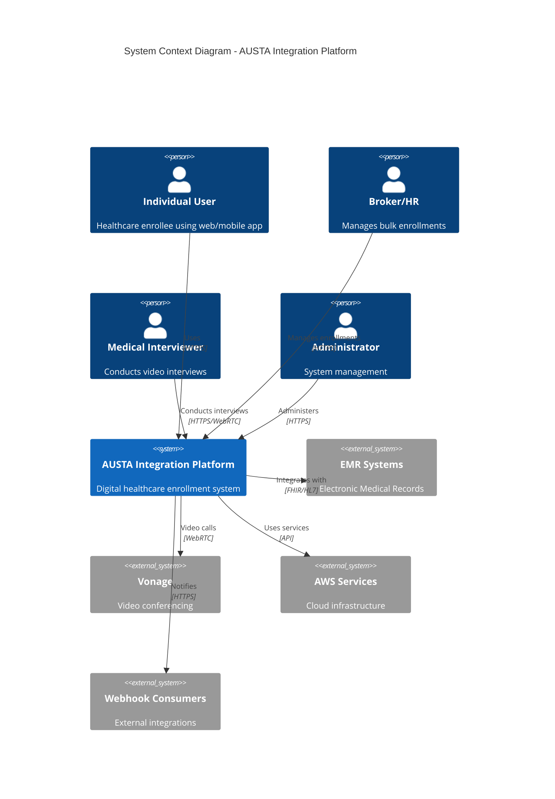

## 2.2 Container Architecture

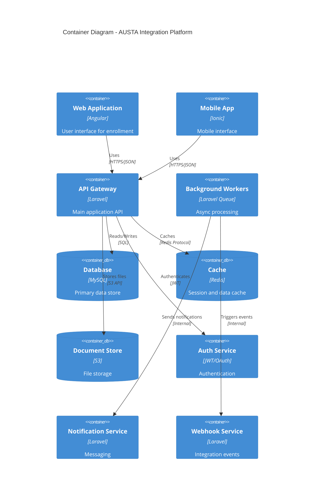

## 2.3 Component Details

### 2.3.1 Frontend Components

| Component | Technology | Purpose | Scaling Strategy |
|-----------|------------|---------|------------------|
| Web UI | Angular 15+ | Primary user interface | CDN distribution |
| Mobile App | Ionic 6+ | Mobile access | Native build optimization |
| Admin Dashboard | Angular | System management | Component lazy loading |

### 2.3.2 Backend Services

| Service | Technology | Responsibility | Scaling Approach |
|---------|------------|----------------|------------------|
| API Gateway | Laravel 9+ | Request routing, validation | Horizontal pod scaling |
| Auth Service | JWT/OAuth | Authentication, authorization | Session replication |
| Document Service | AWS Textract | OCR processing | Queue-based processing |
| Video Service | Vonage API | Interview management | Regional distribution |

### 2.3.3 Data Storage

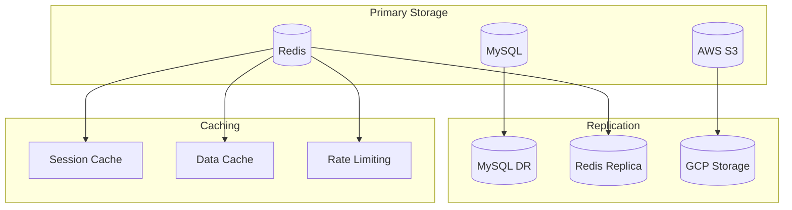

## 2.4 Technical Decisions

### 2.4.1 Architecture Patterns

| Pattern | Implementation | Justification |
|---------|---------------|---------------|
| Monolithic API | Laravel | Simplified deployment, team expertise |
| Event-Driven | Laravel Queue | Async processing, scalability |
| CQRS | Read/Write separation | Performance optimization |
| Circuit Breaker | External services | Fault tolerance |

### 2.4.2 Communication Patterns

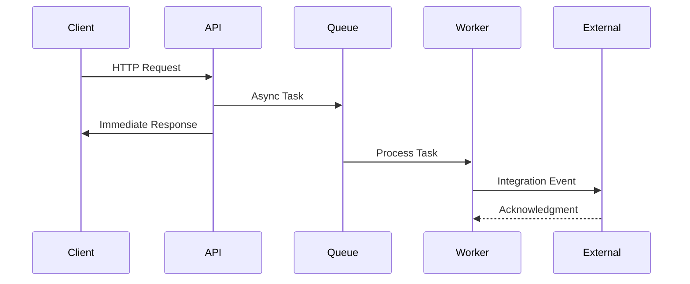

## 2.5 Cross-Cutting Concerns

### 2.5.1 Monitoring and Observability

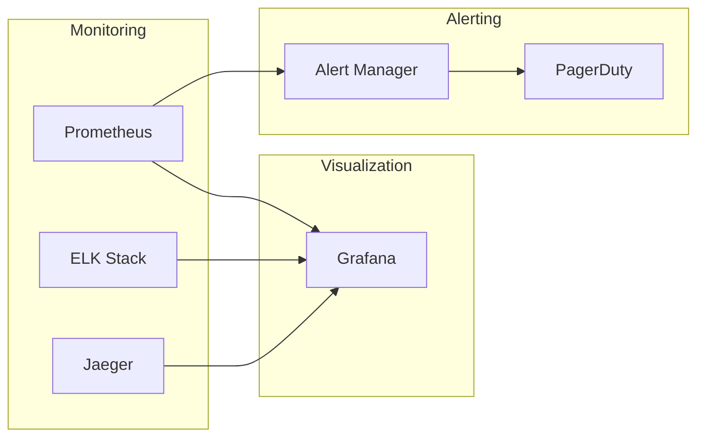

### 2.5.2 Security Architecture

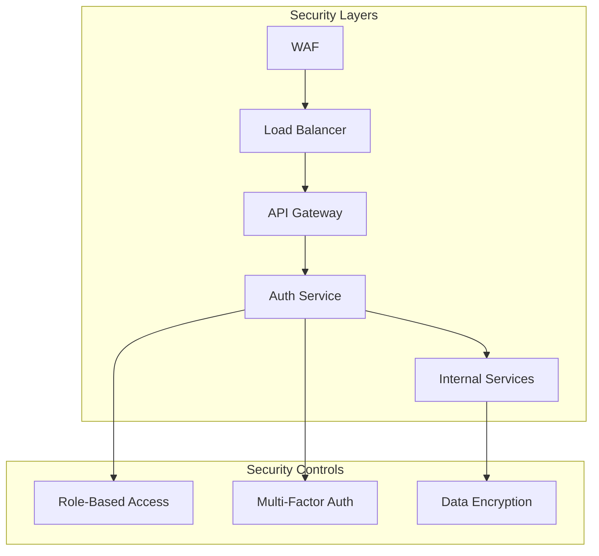

## 2.6 Deployment Architecture

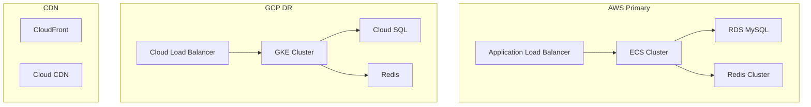

# 3. SYSTEM COMPONENTS ARCHITECTURE

## 3.1 USER INTERFACE DESIGN

### 3.1.1 Design System Specifications

| Component | Specification | Implementation |
|-----------|---------------|----------------|
| Typography | Roboto family | Primary: Regular 400, Headers: Medium 500 |
| Color Palette | Primary: #2196F3, Secondary: #FF4081 | Accessible contrast ratios (WCAG AAA) |
| Spacing System | 8px base unit | Multiples: 8, 16, 24, 32, 48, 64px |
| Breakpoints | Mobile: 320px, Tablet: 768px, Desktop: 1024px | Fluid responsive design |
| Component Library | Angular Material | Custom theme with healthcare focus |
| Accessibility | WCAG 2.1 Level AA | ARIA labels, keyboard navigation |
| Dark Mode | System preference detection | Auto-switching with manual override |

### 3.1.2 Layout Structure

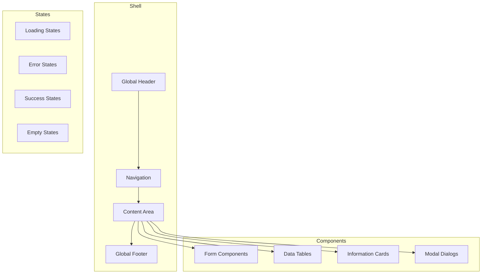

### 3.1.3 Critical User Flows

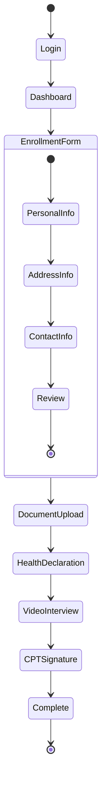

## 3.2 DATABASE DESIGN

### 3.2.1 Schema Design

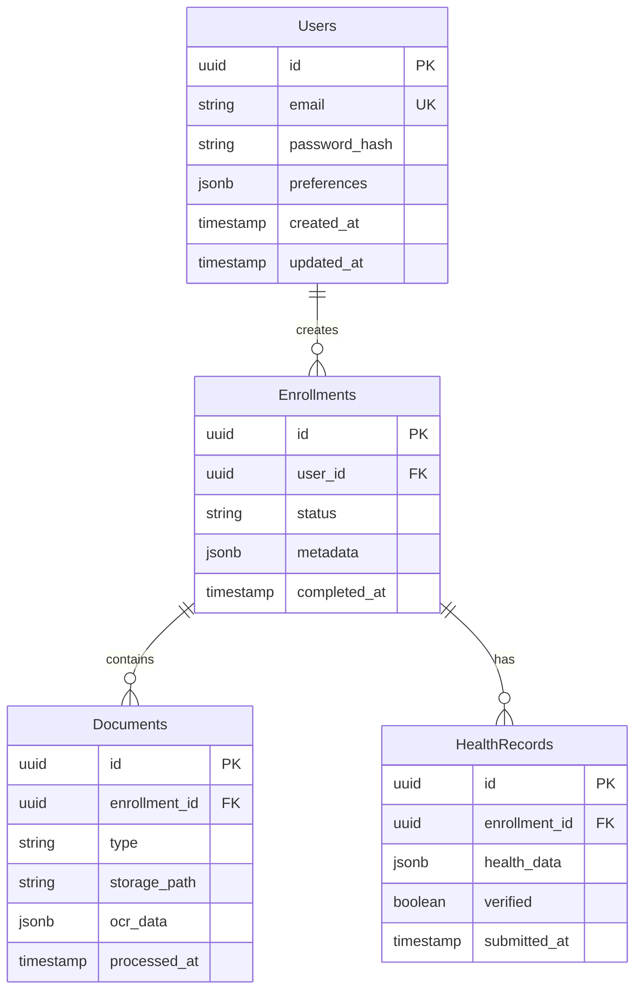

### 3.2.2 Database Configuration

| Aspect | Configuration | Details |
|--------|--------------|---------|
| Engine | MySQL 8.0+ | InnoDB storage engine |
| Character Set | utf8mb4 | Full Unicode support |
| Collation | utf8mb4_unicode_ci | Case-insensitive sorting |
| Connection Pool | 50-200 connections | Auto-scaling enabled |
| Query Cache | Disabled | Using application-level caching |
| Backup Schedule | Daily full, hourly incremental | 30-day retention |

### 3.2.3 Indexing Strategy

| Table | Index Type | Columns | Purpose |
|-------|------------|---------|---------|
| Users | Primary | id | Unique identifier |
| Users | Unique | email | Login lookup |
| Enrollments | Primary | id | Unique identifier |
| Enrollments | Foreign | user_id | Relationship lookup |
| Documents | Composite | (enrollment_id, type) | Filtered queries |
| HealthRecords | Covering | (enrollment_id, verified) | Status checks |

## 3.3 API DESIGN

### 3.3.1 API Architecture

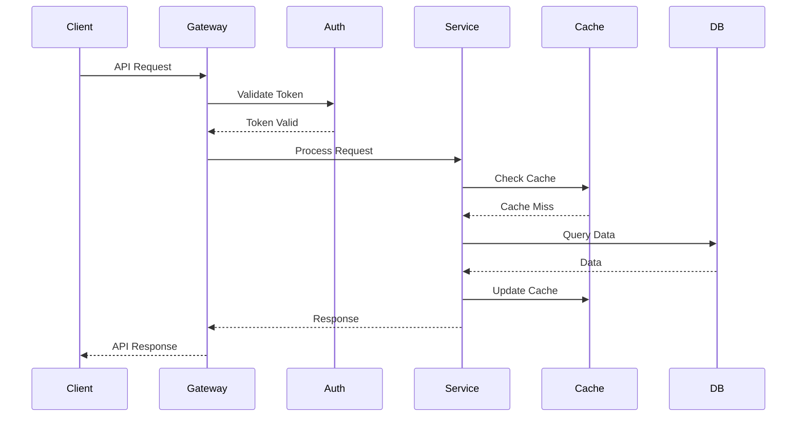

### 3.3.2 API Specifications

| Endpoint | Method | Authentication | Rate Limit |
|----------|--------|----------------|------------|
| /api/v1/enrollments | POST | JWT | 100/min |
| /api/v1/documents | PUT | JWT + Signature | 200/min |
| /api/v1/interviews | GET | JWT | 300/min |
| /api/v1/webhooks | POST | API Key | 500/min |

### 3.3.3 Response Format

```json
{
  "status": "success|error",
  "code": "HTTP_STATUS_CODE",
  "data": {
    "id": "uuid",
    "type": "resource_type",
    "attributes": {},
    "relationships": {},
    "meta": {
      "created_at": "timestamp",
      "updated_at": "timestamp"
    }
  },
  "errors": [{
    "code": "ERROR_CODE",
    "message": "ERROR_MESSAGE",
    "field": "FIELD_NAME"
  }]
}
```

### 3.3.4 Integration Patterns

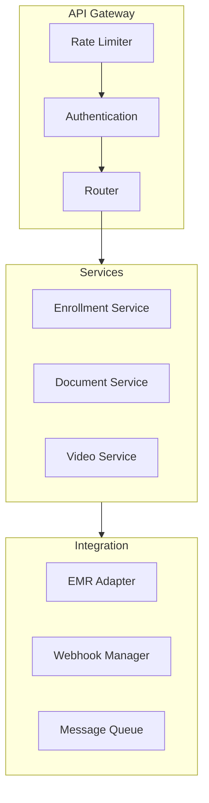

# 4. TECHNOLOGY STACK

## 4.1 PROGRAMMING LANGUAGES

| Platform | Language | Version | Justification |
|----------|----------|---------|---------------|
| Backend | PHP | 8.1+ | Laravel framework requirement, strong typing support, performance improvements |
| Frontend Web | TypeScript | 4.8+ | Type safety for Angular, enhanced developer productivity |
| Frontend Mobile | TypeScript | 4.8+ | Code sharing with web platform, Ionic framework compatibility |
| Database | SQL | MySQL 8.0+ | ACID compliance, healthcare data integrity requirements |
| Infrastructure | HCL | 1.0+ | Terraform infrastructure as code, multi-cloud support |

## 4.2 FRAMEWORKS & LIBRARIES

### 4.2.1 Core Frameworks

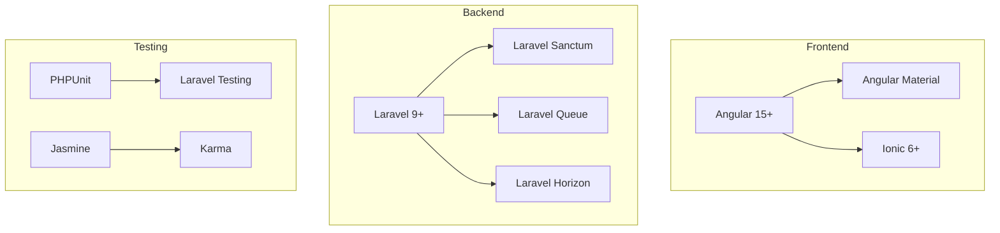

| Framework | Version | Purpose | Dependencies |
|-----------|---------|---------|--------------|
| Laravel | 9.0+ | Backend API and services | PHP 8.1+, Composer 2.0+ |
| Angular | 15.0+ | Web frontend platform | Node.js 16+, TypeScript 4.8+ |
| Ionic | 6.0+ | Mobile application framework | Angular 15+, Capacitor |
| Laravel Sanctum | 3.0+ | API authentication | Laravel 9+ |
| Angular Material | 15.0+ | UI component library | Angular 15+ |

## 4.3 DATABASES & STORAGE

### 4.3.1 Data Architecture

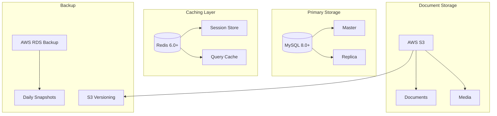

| Component | Technology | Purpose | Configuration |
|-----------|------------|---------|---------------|
| Primary Database | MySQL 8.0+ | Transactional data | InnoDB, UTF8MB4 |
| Cache Layer | Redis 6.0+ | Session/query cache | Cluster mode enabled |
| Document Storage | AWS S3 | File persistence | Server-side encryption |
| Search Engine | MySQL Full-text | Document indexing | InnoDB search |

## 4.4 THIRD-PARTY SERVICES

| Service | Provider | Purpose | Integration Method |
|---------|----------|---------|-------------------|
| OCR Processing | AWS Textract | Document analysis | AWS SDK |
| Email Service | AWS SES | Communication | SMTP/API |
| Video Conferencing | Vonage | Medical interviews | WebRTC |
| Monitoring | AWS CloudWatch | System metrics | AWS SDK |
| Error Tracking | Sentry | Error monitoring | Laravel integration |

## 4.5 DEVELOPMENT & DEPLOYMENT

### 4.5.1 Development Pipeline

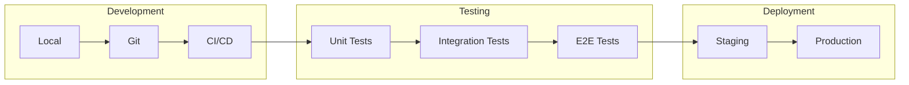

### 4.5.2 Infrastructure Components

| Component | Technology | Purpose | Configuration |
|-----------|------------|---------|---------------|
| Container Runtime | Docker | Application packaging | Multi-stage builds |
| Container Orchestration | ECS | Container management | Auto-scaling enabled |
| Load Balancer | ALB | Traffic distribution | SSL termination |
| CDN | CloudFront | Static content delivery | Edge locations |
| DNS Management | Route 53 | Domain management | Health checks |

### 4.5.3 CI/CD Configuration

```yaml
deployment:
  environments:
    - staging
    - production
  steps:
    - lint
    - test
    - build
    - deploy
  requirements:
    coverage: 80%
    performance: P95 < 200ms
    security: OWASP Top 10
```

### 4.5.4 Monitoring Stack

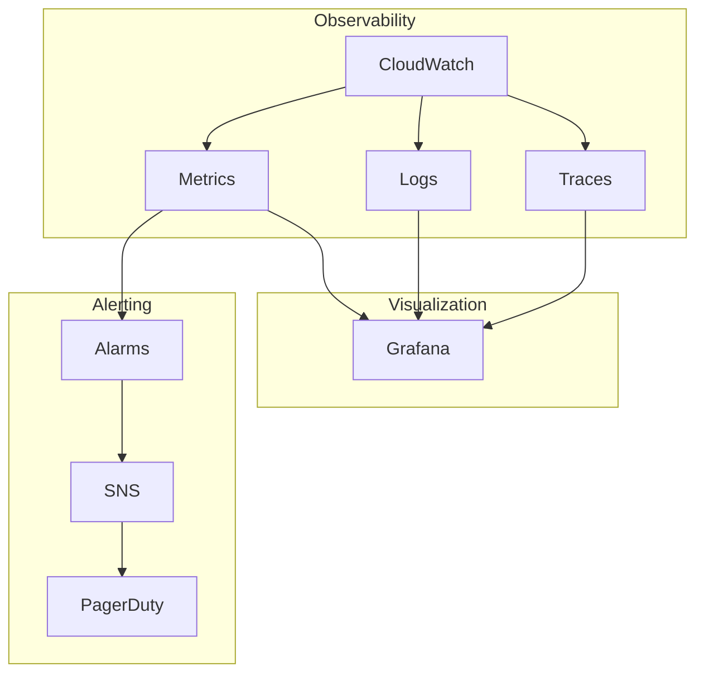

# 5. SYSTEM DESIGN

## 5.1 USER INTERFACE DESIGN

### 5.1.1 Layout Structure

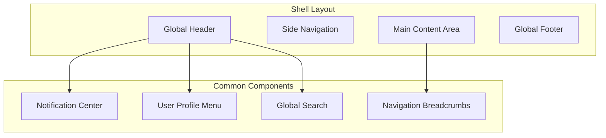

### 5.1.2 Key Screens

| Screen | Components | Functionality |
|--------|------------|---------------|
| Dashboard | Status Cards, Activity Feed, Quick Actions | Overview of enrollment status and tasks |
| Enrollment Form | Multi-step Form, Document Upload, Progress Bar | Digital enrollment process |
| Interview Calendar | Calendar Grid, Time Slots, Availability Toggle | Schedule management for interviews |
| Document Review | Document Preview, OCR Results, Validation Controls | Document processing interface |
| Admin Console | User Management, System Settings, Analytics | Administrative functions |

### 5.1.3 Responsive Breakpoints

| Breakpoint | Width | Layout Adjustments |
|------------|-------|-------------------|
| Mobile | < 768px | Single column, collapsed navigation |
| Tablet | 768px - 1024px | Two columns, expandable navigation |
| Desktop | > 1024px | Full layout with side navigation |

## 5.2 DATABASE DESIGN

### 5.2.1 Schema Design

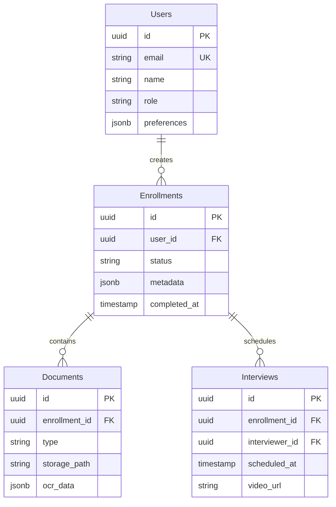

### 5.2.2 Indexing Strategy

| Table | Index Type | Columns | Purpose |
|-------|------------|---------|---------|
| Users | Primary | id | Unique identifier |
| Users | Unique | email | Login lookup |
| Enrollments | Primary | id | Unique identifier |
| Enrollments | Foreign | user_id | Relationship lookup |
| Documents | Composite | (enrollment_id, type) | Document filtering |
| Interviews | Covering | (enrollment_id, scheduled_at) | Schedule queries |

## 5.3 API DESIGN

### 5.3.1 REST Endpoints

| Endpoint | Method | Purpose | Authentication |
|----------|---------|---------|----------------|
| /api/v1/enrollments | POST | Create enrollment | JWT |
| /api/v1/enrollments/{id} | GET | Retrieve enrollment | JWT |
| /api/v1/documents | PUT | Upload document | JWT |
| /api/v1/interviews | POST | Schedule interview | JWT |
| /api/v1/webhooks | POST | Integration events | API Key |

### 5.3.2 API Flow

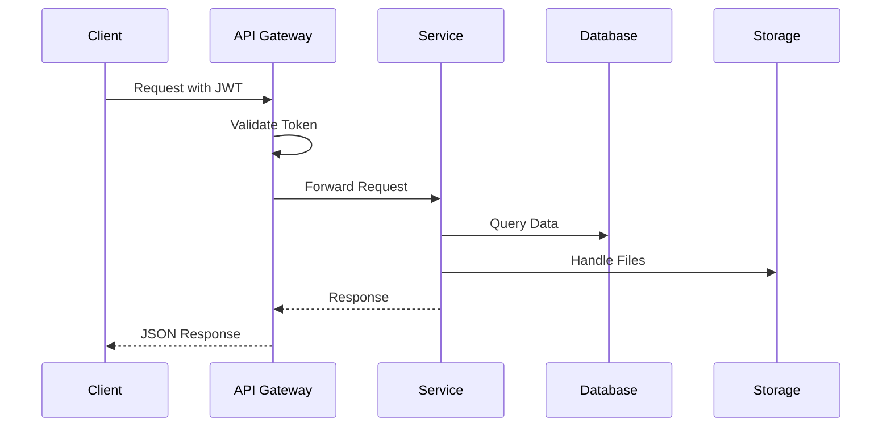

### 5.3.3 Webhook Integration

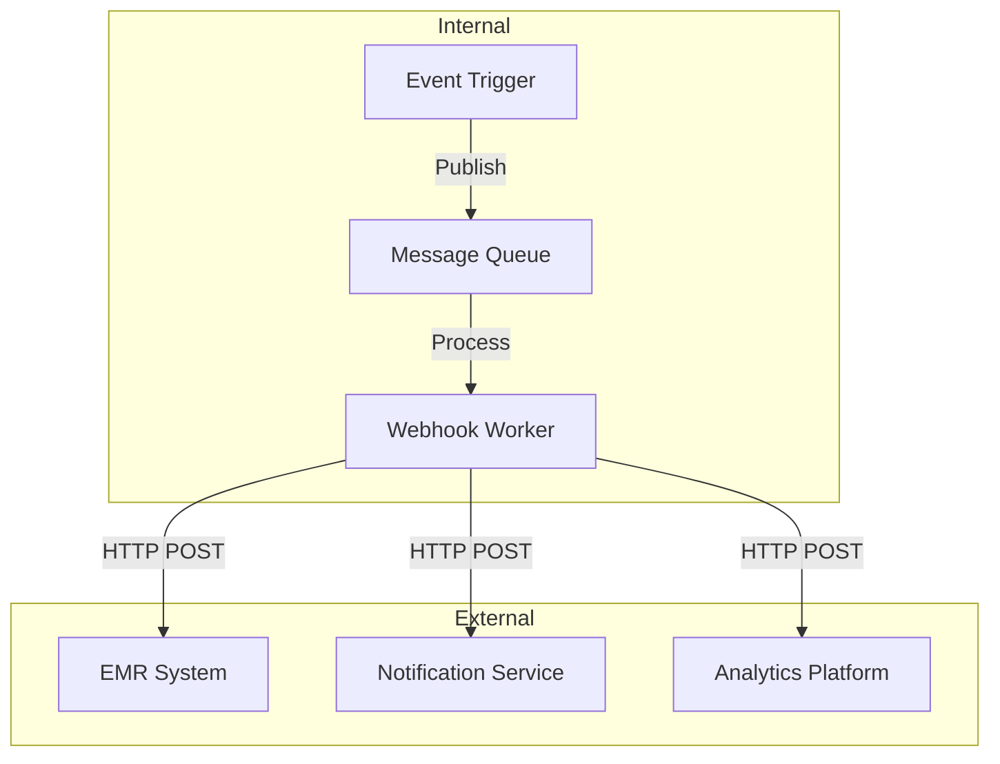

### 5.3.4 Response Format

```json
{
  "status": "success|error",
  "data": {
    "id": "uuid",
    "type": "resource_type",
    "attributes": {},
    "relationships": {},
    "meta": {
      "created_at": "timestamp",
      "updated_at": "timestamp"
    }
  },
  "errors": [{
    "code": "ERROR_CODE",
    "message": "ERROR_MESSAGE",
    "field": "FIELD_NAME"
  }]
}
```

# 6. USER INTERFACE DESIGN

## 6.1 Design System

### 6.1.1 UI Component Key
```
Icons:
[?] - Help/Information tooltip
[$] - Payment/Financial information
[i] - General information
[+] - Add new item
[x] - Close/Delete/Remove
[<] [>] - Navigation arrows
[^] - Upload functionality
[#] - Menu/Dashboard
[@] - User profile
[!] - Alert/Warning
[=] - Settings menu
[*] - Favorite/Important

Input Elements:
[ ] - Checkbox
( ) - Radio button
[...] - Text input field
[====] - Progress bar
[v] - Dropdown menu
[Button] - Action button
```

### 6.1.2 Layout Structure
```
+--------------------------------------------------+
|                  Global Header                    |
| [@User] [#Menu] [=Settings] [?Help] [!Alerts]    |
+--------------------------------------------------+
|          |                                        |
| Primary  |           Content Area                 |
|   Nav    |                                        |
|          |                                        |
|  [#] DH  |                                        |
|  [+] EN  |                                        |
|  [$] FN  |                                        |
|  [@] PR  |                                        |
|          |                                        |
+--------------------------------------------------+
|                  Global Footer                    |
|  Language [v]  |  Support  |  Privacy  |  Terms  |
+--------------------------------------------------+
```

## 6.2 Key Screens

### 6.2.1 Enrollment Dashboard
```
+--------------------------------------------------+
| [@John Doe] [#Dashboard] [=Settings] [!2]        |
+--------------------------------------------------+
| Enrollment Progress                               |
| [=============================------] 85%         |
+--------------------------------------------------+
| Active Enrollments                                |
| +----------------------------------------+       |
| | Name          Status         Actions    |       |
| | Maria S.      Documents [^]   [>]       |       |
| | Carlos R.     Interview [*]   [>]       |       |
| | Ana P.        CPT Sign       [>]       |       |
| +----------------------------------------+       |
|                                                  |
| [+] New Enrollment                              |
+--------------------------------------------------+
```

### 6.2.2 Document Upload
```
+--------------------------------------------------+
| Document Upload                            [?]    |
+--------------------------------------------------+
| Required Documents:                               |
| [ ] ID Document                                  |
|     [^ Upload] or [Camera]                       |
|                                                  |
| [ ] Proof of Address                            |
|     [^ Upload] or [Camera]                       |
|                                                  |
| [ ] Health Declaration                           |
|     [^ Upload] or [Fill Online]                  |
+--------------------------------------------------+
| OCR Status: [===========----------] 45%          |
| [Save & Continue]    [Save Draft]                |
+--------------------------------------------------+
```

### 6.2.3 Video Interview Calendar
```
+--------------------------------------------------+
| Schedule Interview                         [?]    |
+--------------------------------------------------+
| Select Date:                                      |
| [< May 2024 >]                                   |
| Mo Tu We Th Fr Sa Su                             |
|     1  2  3  4  5                               |
|  6  7  8  9 10 11 12                            |
| 13 14 15 16 17 18 19                            |
|                                                  |
| Available Times for May 15:                      |
| ( ) 09:00 - Dr. Silva                           |
| ( ) 10:30 - Dr. Santos                          |
| ( ) 14:15 - Dr. Oliveira                        |
|                                                  |
| [Schedule Interview]                             |
+--------------------------------------------------+
```

### 6.2.4 Health Declaration Form
```
+--------------------------------------------------+
| Health Declaration                         [?]    |
+--------------------------------------------------+
| Personal Information:                             |
| Name: [............................]              |
| Date of Birth: [.../..../....] [!Required]       |
|                                                  |
| Medical History:                                 |
| [ ] Diabetes                                     |
| [ ] Hypertension                                 |
| [ ] Heart Disease                                |
| [ ] Other: [............................]        |
|                                                  |
| Current Medications:                             |
| [+] Add Medication                               |
| +----------------+--------+-------+              |
| | Name           | Dose   | Freq  |              |
| | [...........] | [...] | [...] | [x]          |
| +----------------+--------+-------+              |
|                                                  |
| [Save & Continue]    [Save Draft]                |
+--------------------------------------------------+
```

### 6.2.5 Video Interview Interface
```
+--------------------------------------------------+
| Video Interview                           [?]     |
+--------------------------------------------------+
|  +----------------+      +----------------+       |
|  |                |      |                |       |
|  |   Doctor       |      |    Patient     |       |
|  |    View        |      |     View       |       |
|  |                |      |                |       |
|  +----------------+      +----------------+       |
|                                                  |
| Connection: [============================] Good   |
|                                                  |
| Controls:                                        |
| [Camera On/Off] [Mic On/Off] [Share] [End Call] |
|                                                  |
| Notes: [......................................]  |
| [Save Notes]                                     |
+--------------------------------------------------+
```

## 6.3 Responsive Breakpoints

### 6.3.1 Mobile View (< 768px)
```
+------------------+
| [@] [#] [=] [!] |
+------------------+
|    Content       |
|                  |
| +-------------+  |
| | Card View   |  |
| | [>]         |  |
| +-------------+  |
|                  |
| [+ New]          |
+------------------+
| [Menu v]         |
+------------------+
```

### 6.3.2 Tablet View (768px - 1024px)
```
+--------------------------------+
| [@] [#] [=] [!]     [Lang v]  |
+--------------------------------+
| [#]  |                         |
| [+]  |     Content Area        |
| [$]  |                         |
| [@]  | +------------------+    |
|      | | Card View        |    |
|      | | [>]             |    |
|      | +------------------+    |
+--------------------------------+
```

### 6.3.3 Desktop View (> 1024px)
```
+------------------------------------------------+
| [@] [#] [=] [!]                    [Lang v]    |
+------------------------------------------------+
| [#]  |                                         |
| [+]  |          Content Area                   |
| [$]  |  +-------------+  +-------------+       |
| [@]  |  | Card View   |  | Card View   |       |
|      |  | [>]         |  | [>]         |       |
|      |  +-------------+  +-------------+       |
|      |                                         |
+------------------------------------------------+
```

# 7. SECURITY CONSIDERATIONS

## 7.1 AUTHENTICATION AND AUTHORIZATION

### 7.1.1 Authentication Methods

| Method | Use Case | Implementation |
|--------|----------|----------------|
| JWT | Primary API authentication | Laravel Sanctum with 1-hour expiry |
| OAuth 2.0 | Third-party integrations | Laravel Passport for EMR systems |
| MFA | Administrative access | TOTP via Google Authenticator |
| Biometric | Mobile app authentication | Ionic Native Biometric |
| API Keys | Webhook consumers | SHA-256 hashed keys with rate limiting |

### 7.1.2 Authorization Framework

```mermaid
graph TD
    subgraph Access Control
        JWT[JWT Token] --> Auth[Authorization Service]
        Auth --> RBAC[Role-Based Access]
        RBAC --> Perms[Permission Check]
        Perms --> Resource[Resource Access]
    end

    subgraph Roles
        R1[Individual] --> P1[Basic Access]
        R2[Broker] --> P2[Bulk Operations]
        R3[Interviewer] --> P3[Interview Management]
        R4[Admin] --> P4[Full Access]
    end

    Resource --> Audit[Audit Log]
```

## 7.2 DATA SECURITY

### 7.2.1 Encryption Standards

| Data State | Method | Key Management |
|------------|--------|----------------|
| At Rest | AES-256-GCM | AWS KMS rotation every 90 days |
| In Transit | TLS 1.3 | Auto-renewed certificates via Let's Encrypt |
| Database | Transparent Data Encryption | MySQL Enterprise encryption |
| File Storage | S3 Server-Side Encryption | S3-managed keys with versioning |
| PHI Fields | Field-level encryption | Application-layer encryption |

### 7.2.2 Data Protection Flow

```mermaid
flowchart LR
    subgraph Input
        Raw[Raw Data] --> Val[Input Validation]
        Val --> San[Sanitization]
    end

    subgraph Processing
        San --> Enc[Encryption]
        Enc --> Mask[Data Masking]
    end

    subgraph Storage
        Mask --> DB[(Encrypted Database)]
        Mask --> S3[Encrypted S3]
    end

    subgraph Access
        DB --> Auth[Authorization]
        S3 --> Auth
        Auth --> Log[Audit Logging]
    end
```

## 7.3 SECURITY PROTOCOLS

### 7.3.1 Zero Trust Implementation

```mermaid
graph TD
    subgraph Perimeter
        WAF[WAF] --> ALB[Load Balancer]
        ALB --> API[API Gateway]
    end

    subgraph Authentication
        API --> IdP[Identity Provider]
        IdP --> Token[Token Validation]
        Token --> Session[Session Management]
    end

    subgraph Authorization
        Session --> RBAC[Role Check]
        RBAC --> Policy[Policy Enforcement]
        Policy --> Resource[Resource Access]
    end

    subgraph Monitoring
        Resource --> Log[Audit Logs]
        Resource --> Alert[Security Alerts]
        Resource --> Monitor[Real-time Monitoring]
    end
```

### 7.3.2 Security Controls

| Control Type | Implementation | Monitoring |
|--------------|----------------|------------|
| Access Control | Role-based with least privilege | Real-time access logs |
| Network Security | AWS Security Groups & NACLs | VPC Flow Logs |
| Application Security | OWASP Top 10 mitigations | WAF rules and logging |
| Data Protection | Encryption & masking | Data access auditing |
| Incident Response | Automated alerts & response | 24/7 monitoring |

### 7.3.3 Compliance Measures

| Requirement | Implementation | Validation |
|-------------|----------------|------------|
| HIPAA | PHI encryption, access controls | Annual audit |
| GDPR | Data minimization, consent tracking | Quarterly review |
| LGPD | Privacy controls, data handling | Regular assessment |
| SOC 2 | Security controls framework | External audit |
| ISO 27001 | Information security management | Certification maintenance |

### 7.3.4 Security Monitoring

```mermaid
flowchart TD
    subgraph Detection
        Log[Log Collection] --> SIEM[SIEM System]
        SIEM --> Rules[Detection Rules]
        Rules --> Alert[Alert Generation]
    end

    subgraph Response
        Alert --> Triage[Incident Triage]
        Triage --> Auto[Automated Response]
        Triage --> Manual[Manual Investigation]
    end

    subgraph Recovery
        Auto --> Restore[System Restoration]
        Manual --> Restore
        Restore --> Report[Incident Report]
    end
```

### 7.3.5 Security Update Process

| Component | Update Frequency | Validation Process |
|-----------|-----------------|-------------------|
| OS Patches | Monthly | Test environment validation |
| Dependencies | Weekly | Automated security scanning |
| Security Rules | Daily | WAF rule testing |
| SSL Certificates | 90 days | Automated renewal |
| Security Policies | Quarterly | Compliance review |

# 8. INFRASTRUCTURE

## 8.1 DEPLOYMENT ENVIRONMENT

```mermaid
graph TD
    subgraph Production
        AWS[AWS Primary Region] --> ALB[Application Load Balancer]
        ALB --> ECS[ECS Cluster]
        ECS --> Services[Application Services]
        Services --> RDS[RDS MySQL]
        Services --> Redis[ElastiCache]
        Services --> S3[S3 Storage]
    end

    subgraph Disaster Recovery
        GCP[GCP Secondary Region] --> GCLB[Cloud Load Balancer]
        GCLB --> GKE[GKE Cluster]
        GKE --> DRServices[DR Services]
        DRServices --> CloudSQL[Cloud SQL]
        DRServices --> MemoryStore[Memory Store]
        DRServices --> GCS[Cloud Storage]
    end

    AWS -.-> GCP
```

| Environment | Purpose | Configuration |
|-------------|---------|---------------|
| Development | Local development and testing | Docker Compose, Local MySQL |
| Staging | Pre-production testing | AWS ECS Mini, RDS Small Instance |
| Production | Primary production environment | AWS ECS with Auto-scaling |
| DR | Disaster recovery environment | GCP GKE with Regional Cluster |

## 8.2 CLOUD SERVICES

| Service | Provider | Purpose | Configuration |
|---------|----------|---------|---------------|
| ECS | AWS | Container orchestration | Fargate, Auto-scaling |
| RDS | AWS | Database hosting | MySQL 8.0, Multi-AZ |
| ElastiCache | AWS | Session/cache storage | Redis 6.x, Cluster mode |
| S3 | AWS | Document storage | Standard tier, versioning |
| SES | AWS | Email delivery | Production access |
| Textract | AWS | OCR processing | Async processing |
| CloudFront | AWS | CDN | Edge locations |
| GKE | GCP | DR container orchestration | Regional cluster |
| Cloud SQL | GCP | DR database | MySQL 8.0 |
| Cloud Storage | GCP | DR document storage | Standard tier |

## 8.3 CONTAINERIZATION

```mermaid
graph TD
    subgraph Container Architecture
        App[Application Container] --> Web[Web Server]
        App --> PHP[PHP-FPM]
        App --> Workers[Queue Workers]
        
        Deps[Dependencies Container] --> Composer[Composer]
        Deps --> NPM[Node/NPM]
        
        Build[Build Container] --> Assets[Asset Compilation]
        Build --> Tests[Test Execution]
    end
```

| Image | Base | Purpose | Size Limit |
|-------|------|---------|------------|
| app | php:8.1-fpm-alpine | Application runtime | < 500MB |
| nginx | nginx:alpine | Web server | < 100MB |
| worker | php:8.1-cli-alpine | Queue processing | < 400MB |
| scheduler | php:8.1-cli-alpine | Cron jobs | < 400MB |

## 8.4 ORCHESTRATION

```mermaid
graph TD
    subgraph ECS Cluster
        Service1[Web Service] --> Task1[Web Tasks]
        Service2[Worker Service] --> Task2[Worker Tasks]
        Service3[Scheduler Service] --> Task3[Scheduler Tasks]
    end

    subgraph Auto-scaling
        CPU[CPU Utilization] --> Scale[Scaling Policy]
        Memory[Memory Usage] --> Scale
        Queue[Queue Length] --> Scale
    end

    Scale --> Service1
    Scale --> Service2
```

| Component | Configuration | Scaling Policy |
|-----------|---------------|----------------|
| Web Service | 2-10 tasks | CPU > 70% |
| Worker Service | 2-8 tasks | Queue > 1000 |
| Scheduler Service | 1 task | None |
| Task Memory | 1GB-2GB | Auto-scaling |
| Task CPU | 0.5-1 vCPU | Auto-scaling |

## 8.5 CI/CD PIPELINE

```mermaid
flowchart LR
    subgraph Code
        Git[GitHub] --> Actions[GitHub Actions]
    end
    
    subgraph Build
        Actions --> Lint[Code Linting]
        Lint --> Test[Unit Tests]
        Test --> Build[Build Images]
    end
    
    subgraph Deploy
        Build --> Registry[ECR Registry]
        Registry --> Staging[Staging ECS]
        Staging --> Approve{Approval}
        Approve --> Production[Production ECS]
    end

    subgraph Monitor
        Production --> Logs[CloudWatch]
        Production --> Metrics[Prometheus]
        Production --> Traces[Jaeger]
    end
```

| Stage | Tools | SLAs |
|-------|-------|------|
| Code Analysis | PHPStan, ESLint | < 5 minutes |
| Unit Tests | PHPUnit, Jest | 80% coverage |
| Integration Tests | Laravel Dusk | < 15 minutes |
| Security Scan | OWASP ZAP | Zero high risks |
| Build | Docker multi-stage | < 10 minutes |
| Deployment | ECS Blue/Green | < 5 minutes |
| Validation | Health checks | 30 seconds |

# APPENDICES

## A.1 ADDITIONAL TECHNICAL INFORMATION

### A.1.1 Development Environment Setup

| Component | Version | Configuration |
|-----------|---------|---------------|
| PHP | 8.1+ | memory_limit=512M, max_execution_time=300 |
| Node.js | 16+ | --max-old-space-size=4096 |
| MySQL | 8.0+ | innodb_buffer_pool_size=4G |
| Redis | 6.0+ | maxmemory=2gb, maxmemory-policy=allkeys-lru |
| Docker | 20.10+ | Default resource limits per container |

### A.1.2 Code Quality Standards

```mermaid
graph TD
    subgraph Quality Gates
        Lint[Code Linting] --> Test[Unit Tests]
        Test --> Coverage[Code Coverage]
        Coverage --> Security[Security Scan]
        Security --> Build[Build Process]
    end

    subgraph Metrics
        Coverage -->|Minimum| Threshold[80% Coverage]
        Security -->|Maximum| Vulnerabilities[Zero High/Critical]
        Build -->|Maximum| Time[10 Minutes]
    end
```

## A.2 GLOSSARY

| Term | Definition |
|------|------------|
| Blue/Green Deployment | Deployment strategy using two identical environments for zero-downtime updates |
| Circuit Breaker | Design pattern preventing cascading failures in distributed systems |
| CQRS | Command Query Responsibility Segregation - pattern separating read and write operations |
| DevSecOps | Integration of security practices within DevOps processes |
| Feature Flag | Configuration mechanism for enabling/disabling functionality in production |
| Idempotency | Property where operations can be repeated without changing the result |
| Rate Limiting | Controlling the rate of requests to protect system resources |
| Webhook | HTTP callback mechanism for real-time system integrations |

## A.3 ACRONYMS

| Acronym | Full Form |
|---------|-----------|
| ALB | Application Load Balancer |
| ARIA | Accessible Rich Internet Applications |
| CDN | Content Delivery Network |
| CORS | Cross-Origin Resource Sharing |
| CSRF | Cross-Site Request Forgery |
| DR | Disaster Recovery |
| ECS | Elastic Container Service |
| ELK | Elasticsearch, Logstash, Kibana |
| FHIR | Fast Healthcare Interoperability Resources |
| GDPR | General Data Protection Regulation |
| HIPAA | Health Insurance Portability and Accountability Act |
| LGPD | Lei Geral de Proteção de Dados |
| MFA | Multi-Factor Authentication |
| RBAC | Role-Based Access Control |
| RDS | Relational Database Service |
| REST | Representational State Transfer |
| SES | Simple Email Service |
| SLA | Service Level Agreement |
| SSE | Server-Side Encryption |
| TLS | Transport Layer Security |
| TOTP | Time-based One-Time Password |
| WAF | Web Application Firewall |
| WCAG | Web Content Accessibility Guidelines |
| XSS | Cross-Site Scripting |

## A.4 MONITORING METRICS

```mermaid
graph TD
    subgraph Application Metrics
        A[Response Time] --> B[P95 Latency]
        A --> C[Error Rate]
        A --> D[Request Rate]
    end

    subgraph Infrastructure Metrics
        E[CPU Usage] --> F[Container Stats]
        E --> G[Memory Usage]
        E --> H[Disk I/O]
    end

    subgraph Business Metrics
        I[Enrollment Rate] --> J[Completion Rate]
        I --> K[Interview Success]
        I --> L[Document Processing]
    end

    subgraph Alerts
        B -->|Threshold| M[Alert Rules]
        C -->|Threshold| M
        G -->|Threshold| M
        K -->|Threshold| M
    end
```