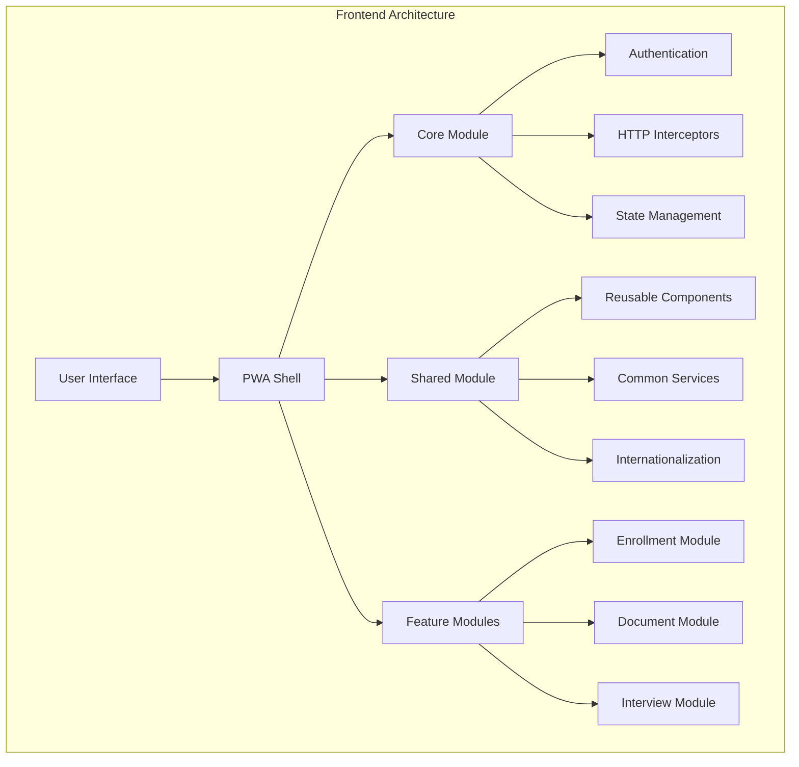
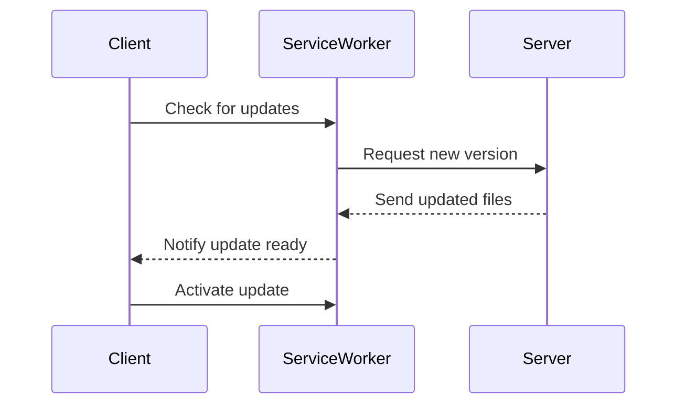

# AUSTA Integration Platform Web Frontend

Enterprise-grade Angular/Ionic web application with PWA capabilities for the AUSTA Integration Platform healthcare enrollment system.

## Project Overview

### Architecture


### Technology Stack
- Angular 15.x
- Ionic 6.x
- Angular Material
- Service Workers (PWA)
- RxJS 7.x
- TypeScript 4.8+
- SCSS
- Jasmine/Karma

### Key Features
- Progressive Web App (PWA) capabilities
- Offline-first architecture
- Multi-language support (pt-BR primary)
- Real-time video interviews
- Document upload/processing
- Responsive design
- Enterprise-grade security

## Prerequisites

- Node.js 16.x
- NPM 8.x
- Angular CLI 15.x
- Ionic CLI 6.x
- SSL certificates for local HTTPS

## Installation

1. Clone the repository
```bash
git clone <repository-url>
cd src/web
```

2. Install dependencies
```bash
npm install
```

3. Configure environment variables
```bash
cp src/environments/environment.example.ts src/environments/environment.ts
```

4. Generate SSL certificates for local development
```bash
mkdir ssl
openssl req -newkey rsa:2048 -nodes -keyout ssl/server.key -x509 -days 365 -out ssl/server.crt
```

## Development

### Local Development Server
```bash
npm start
```
Access the application at https://localhost:4200

### Build Commands
- Production build: `npm run build`
- Staging build: `npm run build:staging`
- Bundle analysis: `npm run analyze`

### Code Quality
- Linting: `npm run lint`
- Unit tests: `npm run test`
- E2E tests: `npm run e2e`
- Security scan: `npm run security-scan`
- Documentation: `npm run compodoc`

### PWA Development

The application is configured as a Progressive Web App with the following features:

1. Service Worker Configuration (ngsw-config.json)
- App shell caching
- API data caching strategies
- Asset caching policies
- Offline capabilities

2. Cache Strategies
- Freshness: Dynamic API data
- Performance: Static resources
- Custom: User profile and configurations

3. Update Flow


## Testing

### Unit Testing
- Framework: Jasmine
- Runner: Karma
- Coverage threshold: 80%
- Command: `npm run test`

### E2E Testing
- Framework: Protractor
- Configuration: e2e/protractor.conf.js
- Command: `npm run e2e`

### Performance Testing
- Lighthouse PWA audit
- Bundle size analysis
- Runtime performance monitoring

## Deployment

### Build Configuration
- Production optimizations enabled
- AOT compilation
- Tree shaking
- Service worker enabled
- Content hashing
- Subresource integrity

### Environment Variables
```typescript
export const environment = {
  production: true,
  apiUrl: 'https://api.austa.health',
  i18nPath: '/assets/i18n',
  pwaEnabled: true
};
```

### CDN Configuration
- Assets served via CloudFront
- Cache-Control headers optimized
- CORS configured for fonts/assets

## Internationalization (i18n)

### Supported Languages
- Portuguese (pt-BR) - Primary
- English (en-US)
- Spanish (es)

### Translation Management
1. Extract strings: `npm run i18n:extract`
2. Translation files in src/assets/i18n/
3. Runtime language switching
4. Fallback chain configured

### Cultural Adaptation
- Date/time formats
- Number formatting
- Currency display
- RTL support ready

## Security

### Implementation
- JWT authentication
- CSRF protection
- Content Security Policy
- Subresource Integrity
- Secure cookie configuration
- XSS prevention

### Best Practices
- Regular dependency updates
- Security headers configured
- HTTPS enforced
- Vulnerability scanning
- Access control implementation

## Performance Optimization

### Strategies
1. Code splitting
2. Lazy loading
3. Preloading strategies
4. Tree-shakeable providers
5. Virtual scrolling
6. Image optimization

### Metrics
- First Contentful Paint < 1.5s
- Time to Interactive < 3.5s
- Performance Score > 90
- PWA Score: 100

## Browser Support
```json
{
  "browserslist": [
    "last 2 versions",
    "not dead",
    "not IE 11"
  ]
}
```

## Additional Resources

- [Angular Documentation](https://angular.io/docs)
- [Ionic Documentation](https://ionicframework.com/docs)
- [PWA Documentation](https://web.dev/progressive-web-apps/)